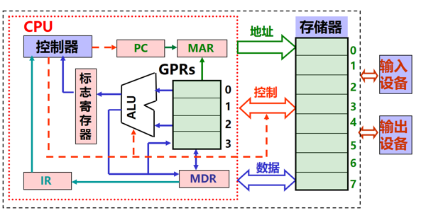
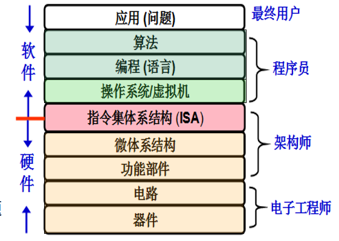
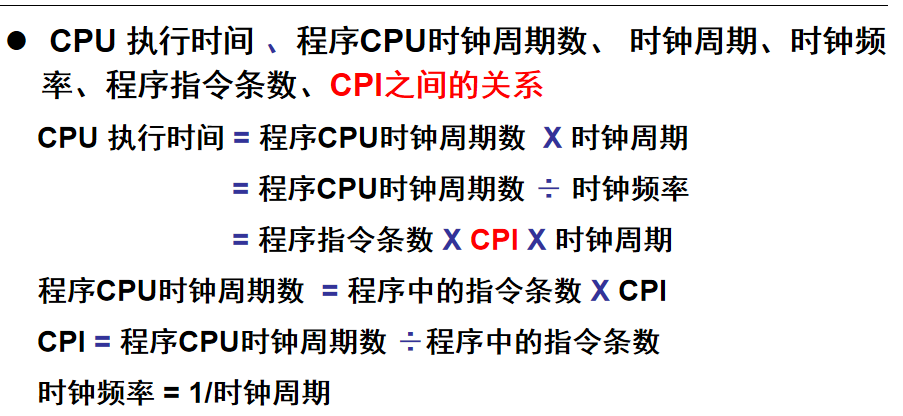

* 冯诺依曼体系结构CPU

  

* 操作系统各抽象层之间的转换

* 翻译程序：

  汇编程序：汇编语言源程序-->机器语言

  解释程序：把源程序中语句按执行顺序逐条翻译成机器指令并立即执行

  编译程序：高级语言-->汇编语言/机器语言

* 指令集体系结构 ISA：规定了软件使用硬件的方式方法,不同ISA规定的指令集不同，如IA-32、MIPS、ARM等

  ISA是计算机硬件和软件的**桥梁**

* 用户程序的执行时间：

  * CPU时间：CPU用于本程序的时间，包括两部分：
    1. 用户CPU时间，指**真正用于运行用户程序代码**的时间
    2. 系统CPU时间，为了**执行用户程序需要CPU运行操作系统程序**的时间
  * 其他时间：等待I/O操作完成的时间，CPU用于执行其他用户程序的时间

* 基本性能评价标准：**CPU的执行时间**

* CPU的主脉冲信号的宽度称为时钟周期，CPU的主频是指CPU主脉冲信号的时钟频

  >一般来说，CPU主频越高，计算机速度越快，但CPU主频和计算机速度并不等价
  >一条指令往往包含多步，需要多个时钟周期才能执行完。

* CPI:执行一条指令所需要的时钟周期数

* 指令周期：取出一条指令并执行这条指令的时间

* MIPS:每秒钟完成的单个运算的指令条数,单位百万