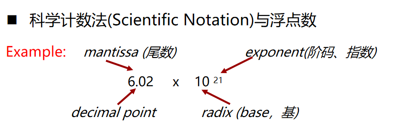
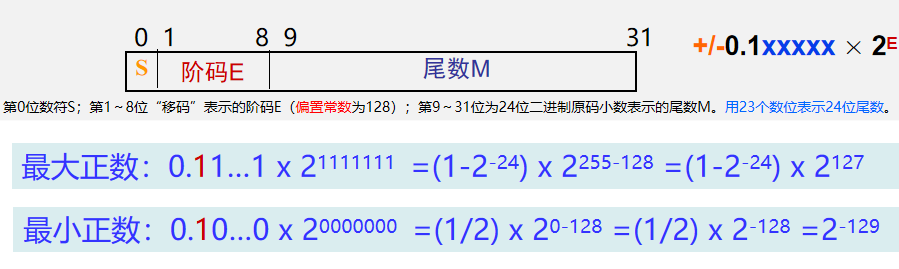
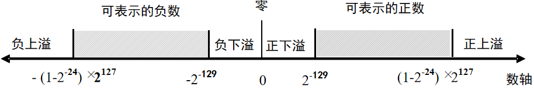
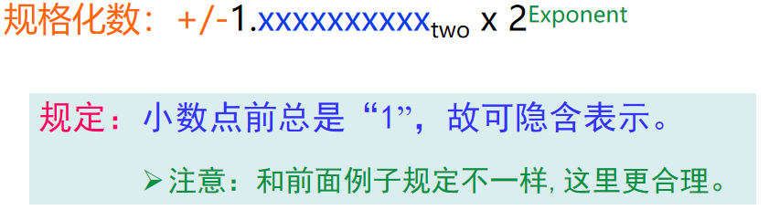
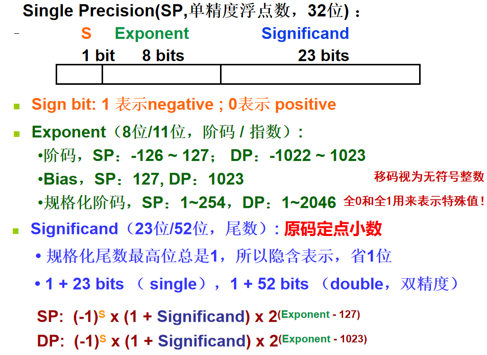
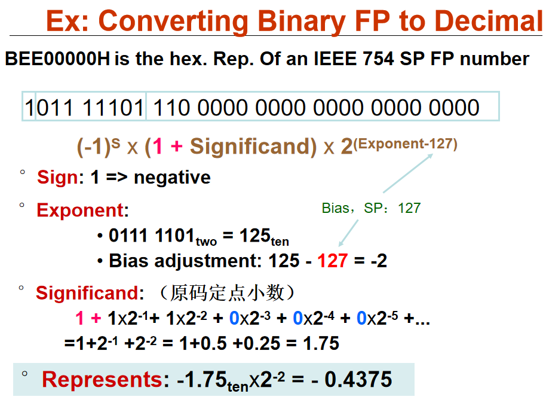
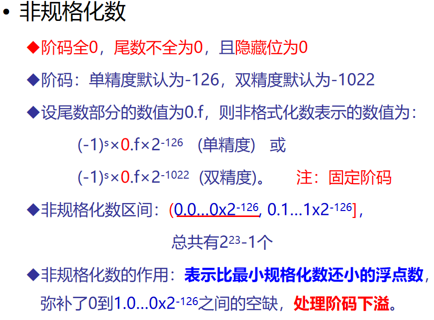
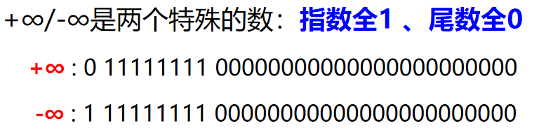
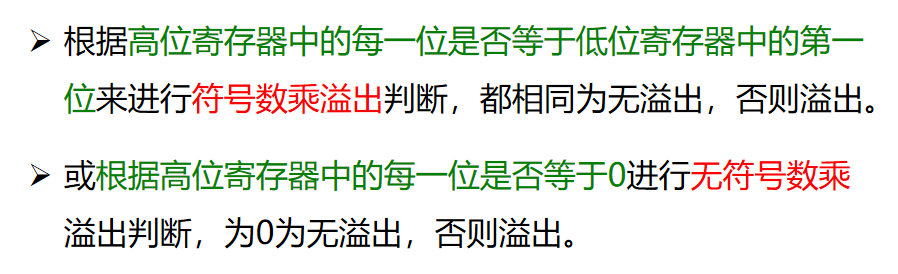
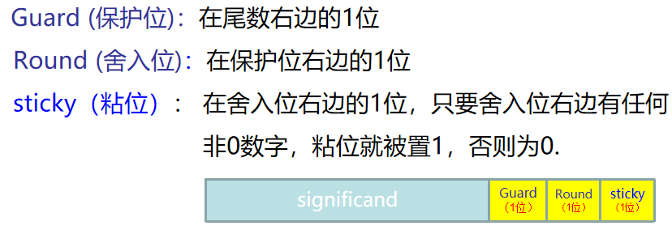

## 2.1 数据的表示

* 整数转换：除基取余，上低下高

  小数转换：乘基取整，上高下低

* **浮点数的尾数用原码定点小数表示**，其他的都用补码表示
* 补码本质上就是一个模M同余数，负数加上模，正数就不变
* 计算机中的运算器是模运算系统
* 移码 = 阶码 + 偏置常数

## 2.3 浮点数的表示

格式：

* 阶码用移码表示，加一个**偏置常数bias，通常是128，IEEE754是127和1023**

* 规格化：小数点前只有一位非0数，尾数用定点小数表示，**规格化后约定整数部为0，而小数点后第一位是1**。这样，第一位默认的“1”可以不明显表示出来,故可用23个数位表示24位尾数

* 浮点数表示：用一个**原码**定点小数表示**尾数**和一个定点整数表示**阶**，再加上**符号位**合并而成。

* 32位规格化浮点数表示范围：

  

  负数：因为原码是对称的，所以其表示范围与正数关于原点对称。

  

* IEEE 754标准：

  

  **规格化的阶码放在框中Exponent，规格化阶码=阶码+bias**

  

  

* 非规格化数：表示比最小规格化数还要小的数

  

* 

* **非数NaN：阶码全1，尾数非0**

* 正负无穷：指数全1，尾数全0

* 当数据是一个不可精确表示的数时，机器将其转换为最邻近的可表示数，因此存在精度误差问题。

* 为与ASCII码区别，将**国标码的两个字节的第一位置“1”后** ，得到一种汉字内码GB2312

## 2.6 数据的宽度和存储

* 位（bit）：bit是计算机中处理，存储，传输信息的**最小单位**

* 字节：八个bit组成的“位组”，**字节是最小可寻址单位**

* 字长：CPU内部用于整数运算的**数据通路的宽度**

  >数据通路：指CPU内部数据流经的路径以及路径上的部件，主要是CPU内部进行数据运算(ALU)、存储(寄存器)和传送(总线)的部件.这些部件的宽度基本上要一致，才能相互匹配。

* 字：表示被处理信息的单位，用来度量各种数据类型的宽度

* 大端存储：最低有效字节放在高地址（顺着存）

* 小端存储：最低有效字节放在低地址

## 2.7 数据的运算

* 逻辑移位：无符号数

  逻辑左移，**移出的高位是 1**，发生**溢出**

  逻辑右移，低位移出，高位补0

* 算术移位：有符号数

  算术左移，**移位后的符号位不同**，发生**溢出**

  算术右移，低位移除，高位补**符**
  
* 截断一个数可能因为溢出而改变初值，引起**截断错误**

* OF溢出标志和SF符号标志，只对带符号数有效

* 对于带符号整数来说，n位整数除以n位整数，除-2n-1/-1= 2n-1会发生溢出外，其余情况都不会发生溢出。

* 乘法溢出判断：

  

* 除法通常采用**朝0方向舍入**

* 带符号负整数：需加偏移量(2k-1)，然后再右移k 位，再低位截断（这里K 是右移位数）

* 加减法：

  1. 求阶差

  2. 对阶，小阶向大阶看齐

     为保证精度，右移低位一般不丢弃，有位置的时候适当保留，称为**附加位**

  3. 尾数加减

* 附加位：