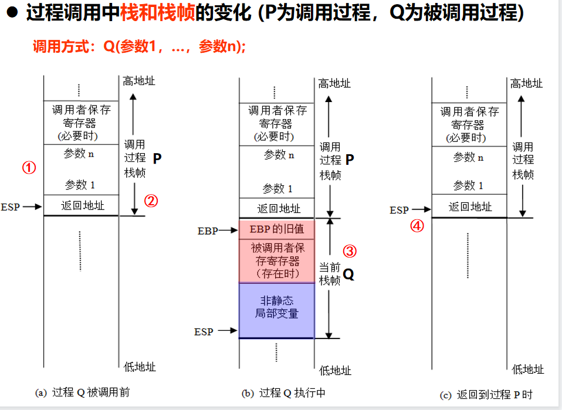

* OF对无符号数无效
* 逻辑运算（NOT不影响标志，其他逻辑指令（OR，AND...）OF=CF=0，而ZF和SF根据结果设置：若全0，则ZF=1；若最高位为1，则SF=1 ）
* 移位运算（左/右移时，最高/最低位送CF）（溢出判别：移位前、后符号位发生变化，则OF=1 ）
* 无符号位above，below；有符号位greater,less
* 返回值默认放在eax/ax
* 过程调用，把可能被修改的寄存器值入栈保存
* 调用者保存参数时，最右边的参数放在地址最高的栈底，即先push、

* ebp保存当前栈帧的起始位置，值固定，高地址
* esp保存当前栈帧的栈顶，值浮动，低地址
* 当前栈帧的范围：EBP~ESP