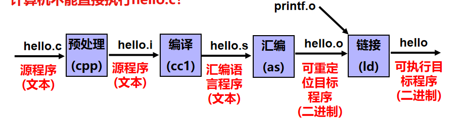
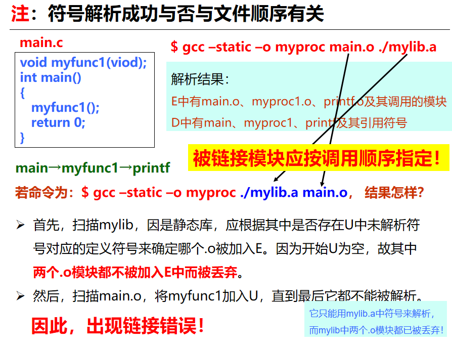

## 目标文件格式

使用链接的好处：

* 模块化

  程序可以分成多个源文件，可构建公共函数库

* 效率高

  时间上可以分开编译，空间上无需包含共享库所有代码

**链接过程的本质：合并可重定位目标文件中相同的节，形成具有统一虚拟地址空间编址的可执行代码文件。**

* bss节存储未初始化的局部变量，仅是占位符，不占任何实际的磁盘空间

* 区分初始化和非初始化是为了空间效率

* 魔数：文件开头用来确定文件类型、格式的几个字节数据

  加载或读取文件时，可用魔数确认文件类型是否正确

## 符号解析与重定位

### 符号解析

全局符号：非static的函数和全局变量

局部符号：模块中定义的static函数和全局变量

外部符号：外部定义的全局符号，本模块引用

> 为什么没有局部变量？
>
> 局部变量是分配在栈中的临时变量，连接器不关心这种局部变量

符号解析：把引用符号和定义符号建立链接的过程

**全局符号的**符号解析

* 强符号定义：函数名和已经初始化的全局变量名

* 弱符号定义：未初始化的全局变量名

  > **本地符号没有强弱之分**

  多重定义符号处理规则：

  强符号只能定义一次，强符号定义cover弱符号定义，多个弱符号定义任选一个（C语言中选内存占用空间最大的那个）

* **符号解析和顺序有关！！**

  

  

  好的做法：把静态库放在命令行最后

### 重定位

ELF：Linux的目标文件格式

PF:Windows的目标文件格式

.data储存的是已初始化的数据

.bss储存的是未初始化的

.text储存的是代码节

步骤：

1. 合并相同节
2. 对定义符号进行重定位，确定其地址
3. 对引用符号进行重定位

### 可执行文件的加载

静态链接和动态链接：

