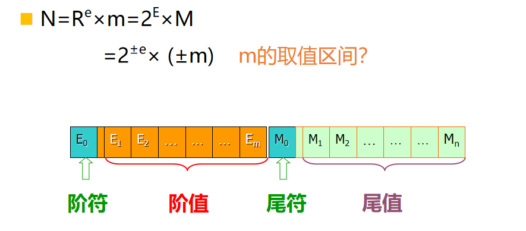
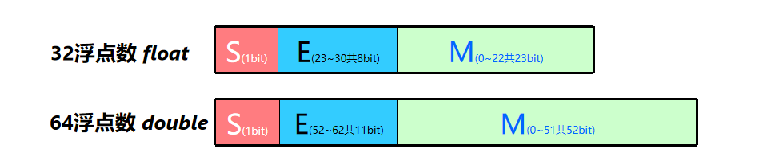
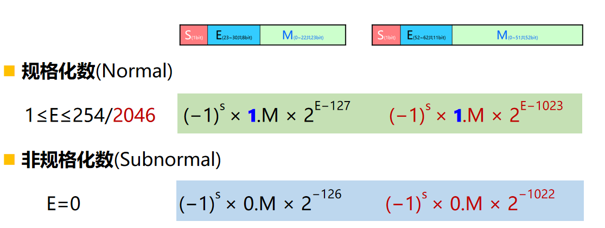
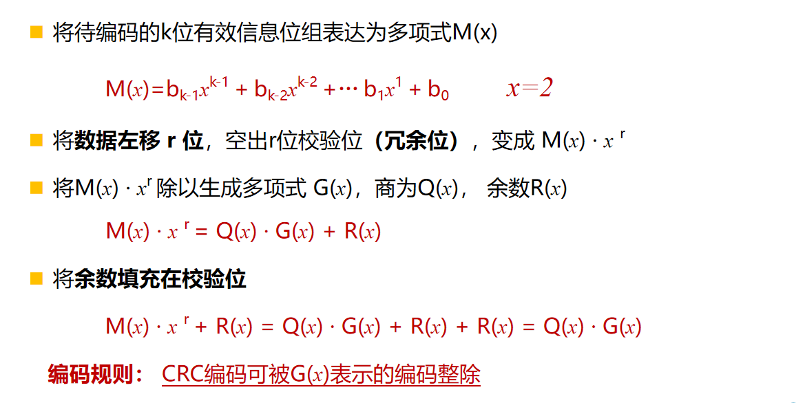

## 2.2 数值数据的表示

1. 原码：在计算机中目前只用于浮点数的尾码表示

2. 反码

3. 补码

   变形补码：模4补码

4. 移码：只用于定点整数表示，直接将真值 x 加一个常数偏移量bias

   * **同一数值的补码和移码除了符号位不一样之外，其他都相同**

   * 移码易于比较大小，可以直接按无符号数的规则比较，难以运算

### 浮点数表示

* 分为阶码E和尾数M两个部分，**阶码位数决定数字表示范围，尾数尾数决定数据表示精度**

* 规格化处理：使得尾数真值最高有效位为1，即尾数绝对值大于等于0.5，表示时无需单独表示最高有效位1，即这位称为**隐藏位**

IEEE754 单精度浮点数

S:数符 E：阶码 M：尾数

* 阶码E采用移码表示偏移量是**127**

  >采用127的原因是使得任何一个规格化数的倒数能用另一个浮点数表示

* M是定点小数，小数点固定在M最左侧，小数点左边还有一个隐藏的1，完整形式是1.M

* 尾数符号位为1表示负数，0表示正数

* 阶码E=255表述无穷大或者NaN

* 阶码和尾数都是0表示机器0

* 

### 2.2.5 计算机中的数据类型

高级语言中的数据类型

* 同字长转化，机器码不变，数据解释方式改变
* 小字长转大字长，**原数据**无符号则零扩展，有符号则符号扩展
* 大字长转小字长，截短机器码

浮点数据类型转换

* float->double:无损
* int->double：无损
* int->float：数据24-31位非0，发生精度溢出，要舍入处理
* float/double->int：小数部分摄入，大数转换可能溢出
* doouble->float：大数转换可能溢出，高精度转换可能舍入
* 浮点数不满足结合律，大数+小数可能还是大数：（d+f）-d==f不成立（d为double，f为float）

## 2.4 数据信息的校验

* 码距与检错，纠错能力：

  | 码距             | 检错，纠错能力               |
  | ---------------- | ---------------------------- |
  | d>=e+1           | 可检测e个错误                |
  | d>=2t+1          | 可以纠正t个错误              |
  | d>=e+t+1 && e>=t | 可以检测e个错误并纠正t个错误 |

* 交叉奇偶校验可以检测出所有的奇数位错，所有双位错和所有3位错，大多数4位错（4位在矩形四个顶点除外）

### 2.4.4 循环冗余校验

