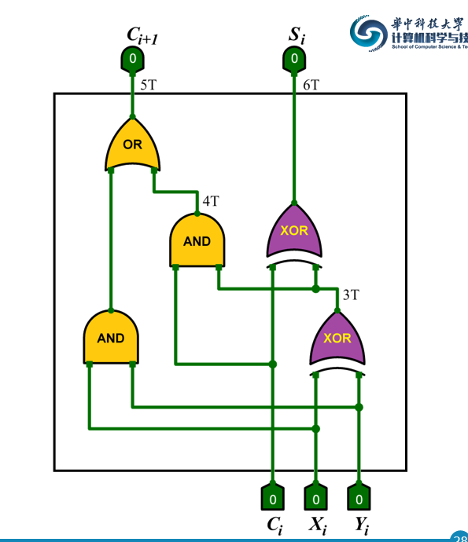
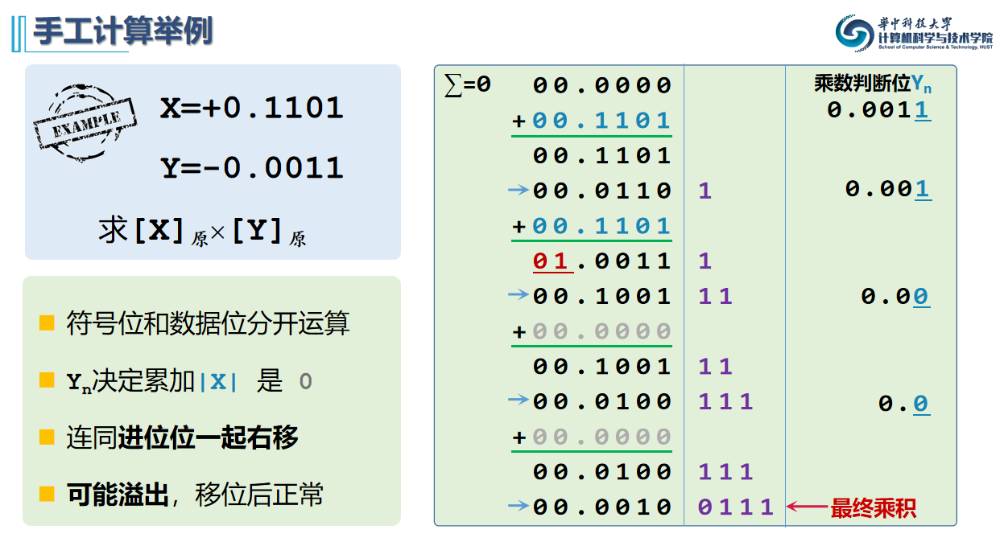
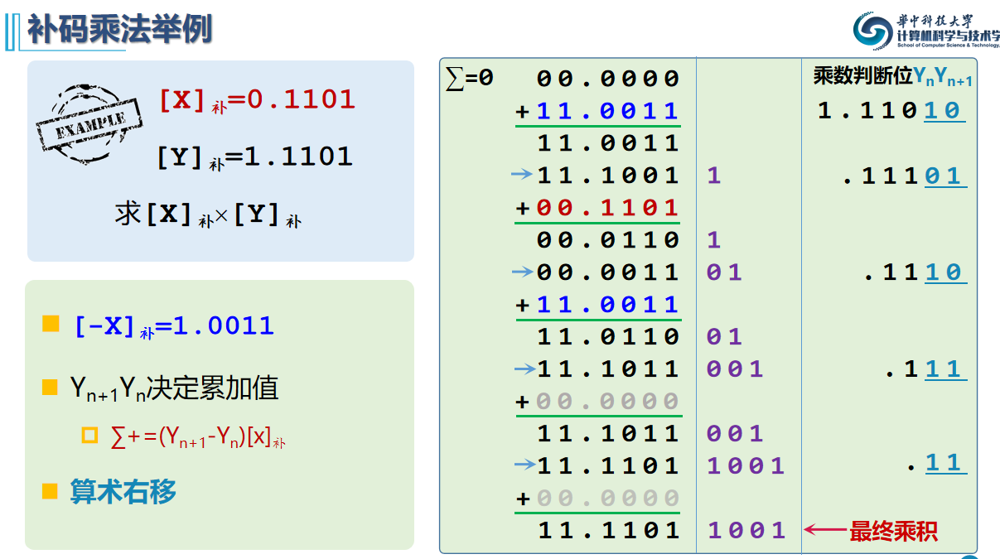

## 3.2 定点加减法运算

补码加减法：
$$
[x]_补+[y]_补=[x+y]_补（mod \ M）\\
[x]_补+[-y]_补=[x-y]_补=[x]_补-[y]_补\ (mod\ M)
$$

* 溢出:

  正+正=负

  负+负=正

  可以根据符号位和最高数据位的进位是否一致判断，不一致就溢出

* 运算器时间：

  
  $$
  C_n=(2n+3)T\\
  S_{n-1}=(2(n-1)+3)T+3T=(2n+4)T\\
  overflow信号=(2n+6)T
  $$

* 无符号的overflow就是Cn，有符号是最高数据位进位和符号位进位异或

* y补对**符号位一起求反，末尾加1**可得[-y]补

并行加法器
$$
C_1=G_0+P_0C_0\\
C_n=G_{n-1}+P_{n-1}C_{n-1}
\\G_i=X_iY_i\\
P_i=X_i\bigoplus Y_i
$$

## 3.3 定点乘法运算

原码一位乘法：判断完结果符号位，理由类似手工计算的方法算出数值

补码一位乘法：

操作流程和原码类似，不同的在乘数后面加一位附加位初始为0
$$
y_ny_{n+1}=01 \ \ \ \ \ \ +[x]_补 \\
y_ny_{n+1}=00/11 \ \ \ \ \ \ +0\\
y_ny_{n+1}=10 \ \ \ \ \ +[-x]_补
$$
最后一步数据不移位

## 3.5 浮点运算

浮点加减法：

1. 对阶

   * 小阶码向大阶码看齐

   * 求阶差，调整阶码和尾数的移位

2. 尾数运算

3. 结果规格化

4. 舍入

5. 溢出判断

   仅阶码溢出才代表结果溢出

浮点数乘法：

1. 阶码相加
2. 尾数相乘（记得隐藏位也要加上参与运算）
3. 规格化舍入

浮点数除法：

1. 尾数调整（最多右移一次）
2. 阶码求差
3. 尾数相除（隐藏位参与）
4. 规格化舍入

## 3.6 运算器

### ALU算术逻辑单元

----对**定点数据**进行加工处理的纯**组合逻辑电路**，功能包括**算术运算**和**逻辑运算**

### 通用寄存器组

### 输入，输出数据选择控制

### 内部总线

* 通常会把乘法器和除法器从ALU中玻璃出来，进行乘除法运算需要相对复杂的时序控制
