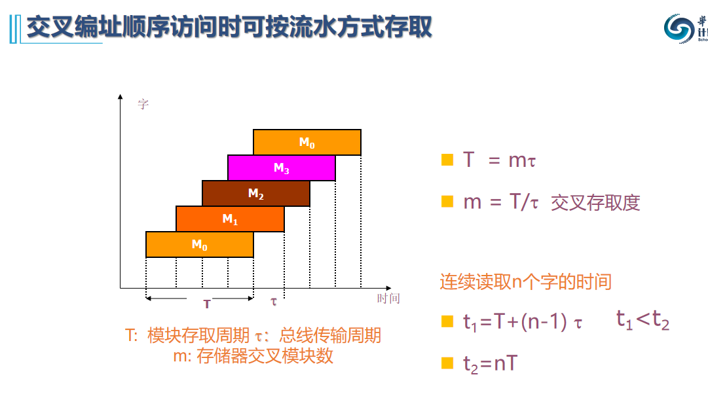

## 4.1存储器概述

### 4.1.2 存储器技术指标

1. 存储容量

   位表示法：1K*4 表示该芯片有1K个单元，每个存储单元的长度为4个二进制位

   字节表示法：以存储器中的单元总数表示，一个单元由8个比特位构成，成为一个字节，如128B表示芯片有128个单元

2. 存取速度

   主存存储周期略大于存取时间的原因：存储周期=存储时间+存储器状态的稳定恢复时间

3. 存储器带宽

   单位时间内存储器所能传输的信息量，单位：位/秒，字节/秒

### 4.1.3 存储系统层次结构

### 4.1.5 主存中数据存放

* 存储字长：主存的一个存储单元能够存储的二进制位数
* 数据字长（简称字长）：计算机一次能处理的二进制数的位数

二者不一定相同

## 4.2 半导体存储器

存储单元：存储器中最小存储单元，作用是存储**一位二进制信息**

* 大容量存储器中普遍采用双译码结构

### 静态MOS存储器

SRAM地址线同时传送行列，DRAM地址线复用，是行列中比较大的那个，刷新开销看行数

### 动态MOS存储器

* DRAM

  提高存储密度：

​		1. 去掉两个负载管

​		2. 增加两个电容缓存电荷

​		因此读会比SRAM更慢，还顺带充个电

​		读过程比写复杂、速度慢

* DRAM刷新

  定期补充电荷以避免电荷泄露引起的信息丢失

  1. 集中式刷新：在数据丢失之前刷新所有行，存在**死区**，在**实时要求不高**的场合使用

     

  2. 分散刷新：读写+刷新   各刷新周期分散安排在存取周期中 用在低速系统

     

  3. 异步刷新：每隔2ms/128=15.5微秒刷新一行,将128次刷新分散

     ​	

  

  

### 只读存储器

## 4.3 主存的组织及与CPU的连接

* 存储器扩展
  1. 字长扩展（数据总线扩展）：各芯片并行工作
  2. 字数扩展（地址总线扩展）：同一时刻仅有一个芯片工作
  
  

## 4.5 高速缓冲存储器

#### 4.5.3 cache的基本概念

基本术语：

* hit , hit rate , hit time

* miss , miss rate , miss penalty(缺失损失)

* block：cache与主存交换的最小单位，大于等于CPU访问的地址（字），根据时间和空间局限性预取

* 行/槽 Line/Slot：标记，标志位，数据块容器

  搬运的是数据块副本，不是直接拿走数据，是复制了放到cache！

* Cold Cache ， Warm Cache

  cache刚开始使用的时候或者进程切换的时候cache没有有效数据，即为Cold Cache

  使用一段时间后有有效数据，即为Warm Cache

cache关键技术

* 数据查找

  主存地址 --> cache 地址 --> cache 数据

  建立查找表，将主存块号和cache块号的映射记录下来

  利用相联存储器实现**并行查找**

  相联存储器按内容进行访问，以关键字作全局**并发比较**，硬件成本高（比较器多），通常用于存放查找表或者全相联cache

  存储容量=查找表容量=表项数*表项大小

  

  为了减少存储器表的大小，**直接继承块内偏移**，查找表表项内容(valic,主存块地址，cache块地址)，查找表项数目=cache数，减少存储大小

* 地址映射

  * 直接相联：放麻烦，找容易

    减少成本，冲突可能性增大

    

    

  * 全相联：放容易，找麻烦

    成本高，冲突少

    

    

  * 组相联：折中

    组内直接相联，组间全相联

    组内全相联，组间直接相连

    

* 替换策略

  * 先进先出
  
  * 最近最不经常使用方法--LFU
  
    
  
  * 近期最少使用法--LRU
  
    
  
    优点：**使得计数器的计数位数变得有限，LFU会越计越多**
  
    缺点：有时候会误判（考前临时抱佛脚）
  
  * 随机替换法
  
* 写入策略

  * 写回法
  
    只修改cache不立即写入内存，当该行被替换出cache才把脏数据写回主存
  
  * 写穿法
  
    只能保证单CPU下cache和主存内容一致性，多CPU不行
  
  * 写分配
  
  * 写不分配

## 4.6 虚拟存储器

* 层次结构

  

* 虚拟存储器本质：虚拟地址映射到内存和**磁盘**里面，提供一种有很大存储空间的假象
* 虚存机制由硬件软件协作实现
  * 进程及进程上下文切换、存储器分配
  * 虚拟地址空间管理、缺页处理
  * 存储器保护
  
* 一个进程有一个完整页表，页表常驻内存

* **页表基址寄存器PTBR存放页表在主存中的首地址**
* 页表项地址 PTEA = PRBR + VPN * 页表项字节大小
* TLB本质上是一个容量较小的cache，**用于存储常用页表项**
* TLB离CPU更近，速度更快，称为快表，主存中页表称为慢表
* 有快表和慢表的存储系统中，查询两个表一起查，不同的是慢表是按地址进行访问，快表直接按内容即VPN进行查找

与CPU Cache相同与差异

* 相同：

  将程序中常用的部分驻留在高速存储器

  数据的换入换出由硬件或操作系统完成，对用户透明
  充分利用程序局部性

* 差异：

  虚存用于扩大主存容量，cache用于加速主存性能

  虚存未命中性能损失远大于cache

  虚存由硬件和OS联合管理，cache由硬件管理

TLB命中，页命中，cache命中

* TLB命中页一定命中
* 页载入主存和数据块载入cache不同步
* 页缺失说明页不在主存，TLB不可能有对应页表项
* 页缺失说明数据也不在主存，cache不可能命中？