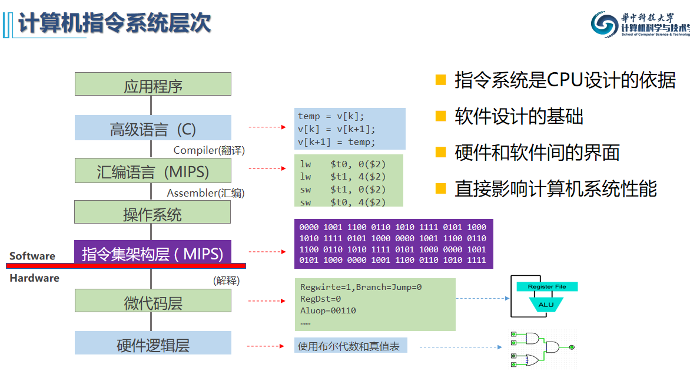
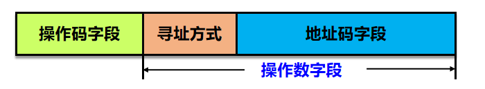
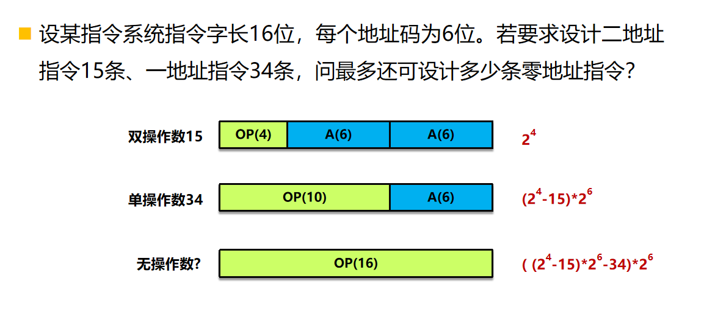
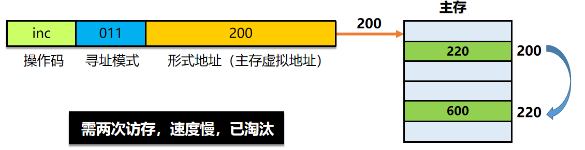
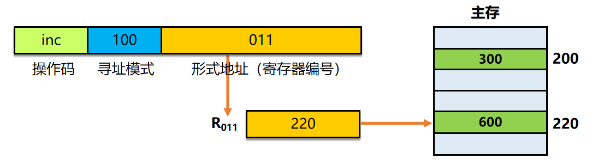
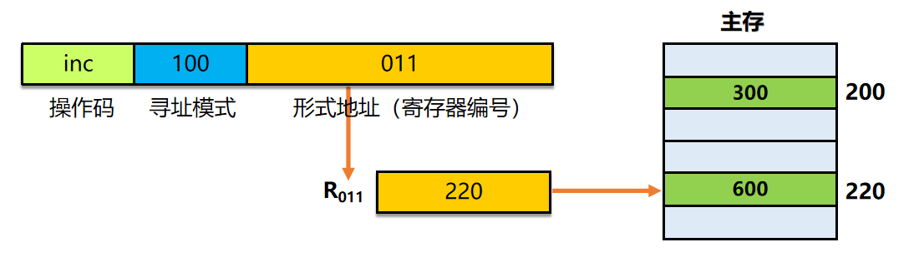
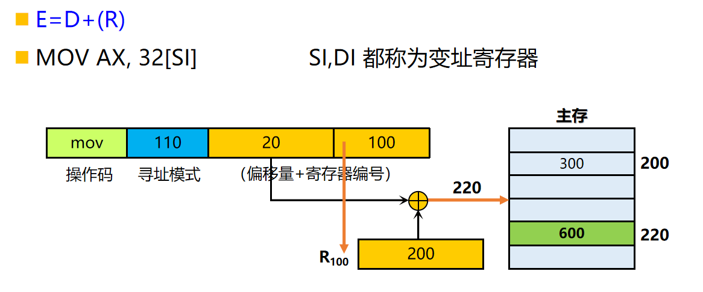
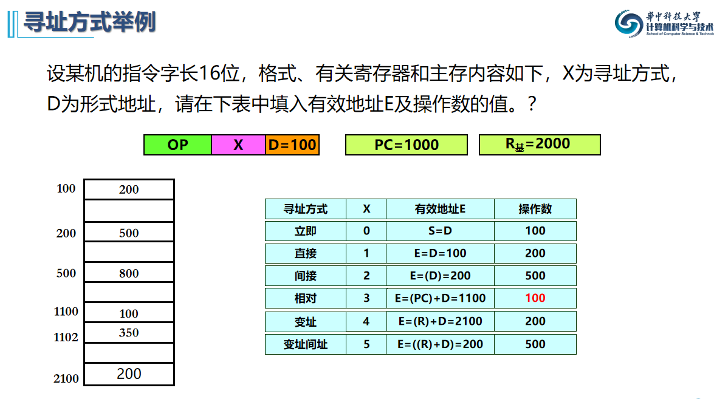
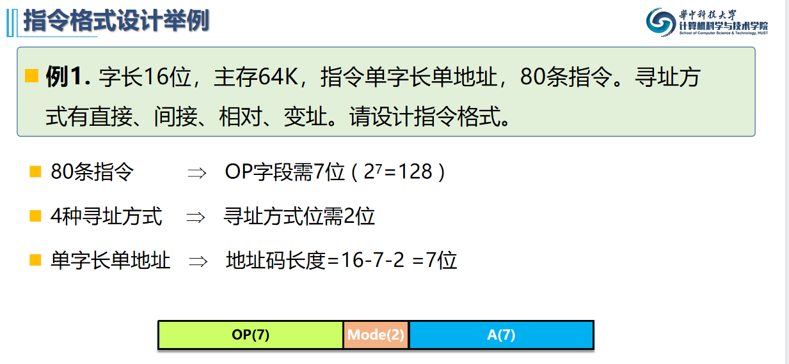
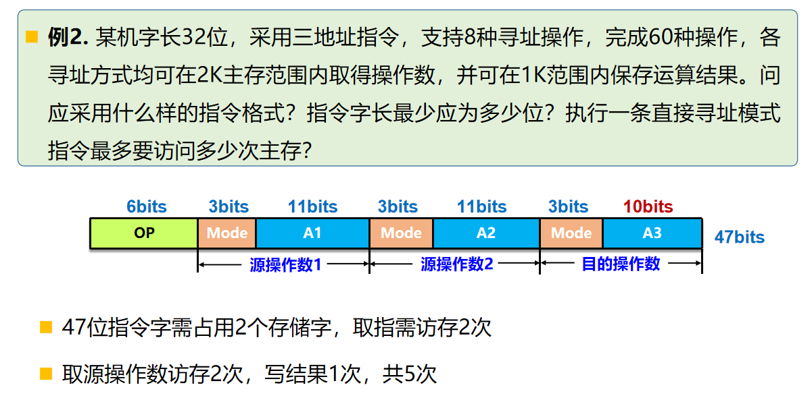

## 5.1 指令系统基本概念

* 指令系统：一台计算机中所有机器指令的集合
* 指令集体系结构 ISA

## 5.2 指令格式

* 操作码字段长度决定指令系统规模 

## 5.3 寻址方式

指令寻址：

1. 顺序寻址
2. 跳跃寻址

操作数寻址：

实际有效地址为 E, 实际操作数 S

1. 立即寻址

2. 寄存器寻址

3. 直接寻址：地址码字段直接给出操作数在内存的地址.  E=D

4. 间接寻址：S=((D))，E=(D)，需要两次访存，已淘汰

   

5. 寄存器间接寻址

   

6. 相对寻址：D单元的内容是操作数的地址,D是操作数地址的地址

   

7. 基址/变址寻址

   操作数地址为基址/变址寄存器+偏移量      基址寄存器一般不修改

   

## 5.4 指令类型

## 5.5 指令格式设计

## 5.6 RISC和CISC

* CISC---复杂指令系统计算机 
  指令数量多，指令功能，复杂的计算机。
  eg: **Intel X86**
*  RISC---精简指令系统计算机
  指令数量少，指令功能单一的计算机。
  1982年后的指令系统基本都是RISC 
  eg: **MIPS、RISC-V**
* CISC、 RISC互相融合

## 5.7 指令系统举例

* I型指令就是直接寻址和一个寄存器作为源操作数，rt作为目的操作数

* 伪直接寻址：26位，末尾加两个0，再取PC的高四位作为前四位

  
