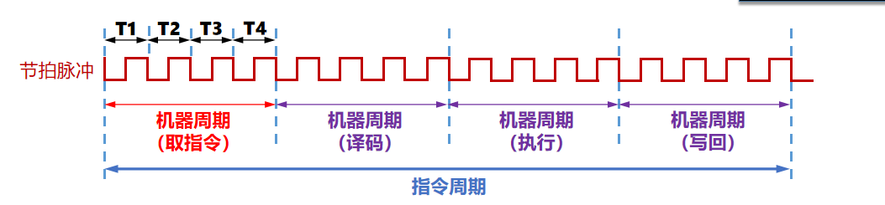
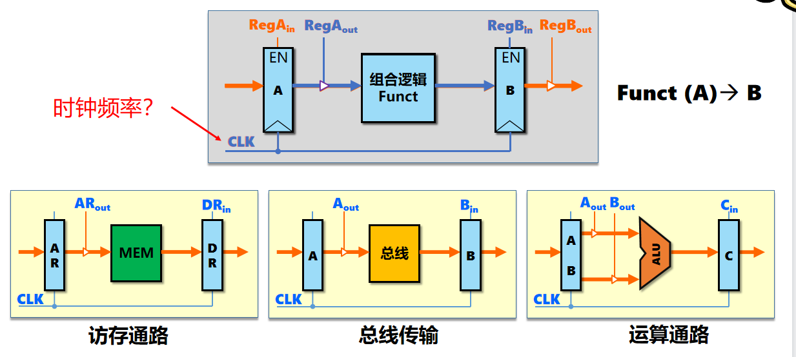
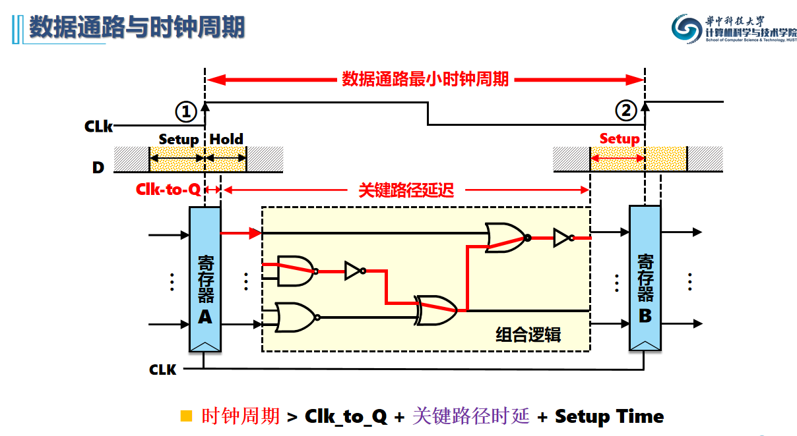
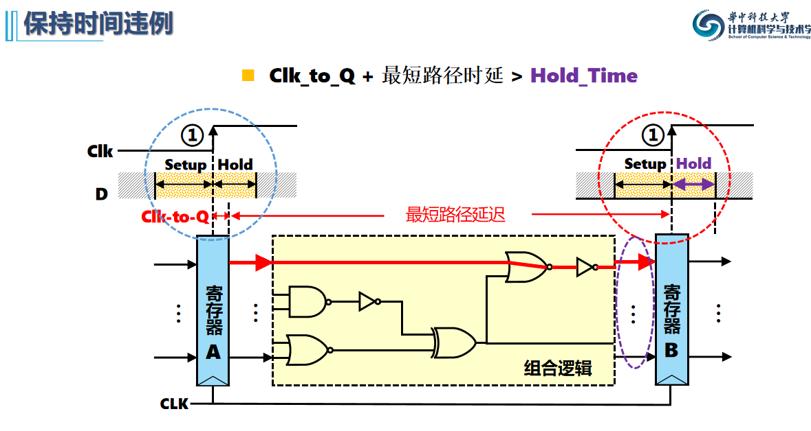

## 6.2 指令周期

指令执行一般流程：

1. 取数指令（PC++）
2. 指令译码
3. 操作数地址计算
4. 取操作数
5. 数据操作，指令执行
6. 操作数地址计算
7. 存操作数
8. 若无中断，返回第一步

> 哈弗结构：将程序指令存储和数据存储分开的储存器结构，从空间上区分数据和程序指令

指令周期：

* 时钟周期：节拍脉冲，一个T，**能完成一次微操作**
* 机器周期=CPU周期，从主存读出一条指令的最小时间，**能完成复杂操作**
* 指令周期：从主存取出一条指令并执行指令的时间
* 执行周期包含0~n个机器周期，机器周期包含k个节拍，k由数据通路决定，n由访存速度决定

指令周期同步：

* 定长指令周期，全部固定，**按机器周期同步**，mips单周期，设计简单，牺牲性能（木桶效应，指令要和最长的齐平）
* 变长指令周期，机器周期数，节拍数可变，**按时钟周期同步**，mips多周期，提高效率，难以设计

## 6.3 数据通路及指令操作流程

数据通路：执行部件间传输信息的路径

* 通路的建立由控制型号控制，受时钟驱动

* 数据通路抽象模型（寄存器传输）

  > RTL：Register Translate Level / Language

  

* D触发器定时模型：

  * 时钟触发前稳定一段**建立时间**
  * 时钟触发后稳定一段**保持时间**
  * 建立时间和保持时间由寄存器本身决定
  * 时钟触发到输出稳定也有一段延迟，触发器延迟Clk_to_Q
  
  

* addi和add的区别：

  addi：rs寄存器内容和IR指令字中的立即数相加，结果存入rt寄存器

  add：rs寄存器内容和rt寄存器内容相加，结果存入rt寄存器

* 最小时钟周期：
  $$
  T_{min\_clk}=T_{clk\_to\_q}+max(T_{alu},T_{mem})+T_{setup}\\
  T_{mem}:访存通路\\
  T_{alu}:计算通路
  $$

## 6.4 时序与控制

* **不能对时钟进行逻辑操作！！！**
* 现代时序只有时钟信号

## 6.5 硬布线控制器

## 6.6 微程序控制器

* 水平微指令面向数据通路描述
* 垂直微指令面向操作算法描述，类似汇编

## 6.7 异常与中断处理
