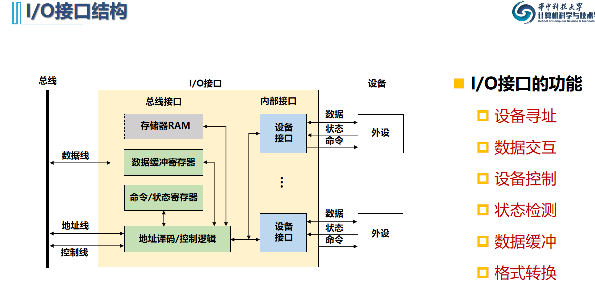
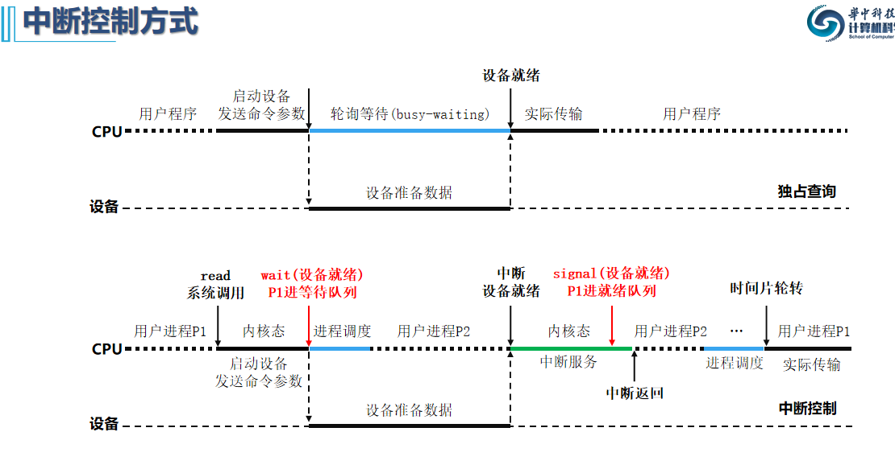

## 9.1 输入输出设备与特性

* 异步性，实时性，独立性
* 如何把异步信号变成同步信号：用寄存器锁存

## 9.2 I/O接口

* I/O接口：链接总线与IO设备的物理和逻辑界面

* 接口的结构和功能：

  

## 9.3 数据传输控制方式

### 程序查询方式

## 9.5  程序中断方式

## 9.6 DMA方式

基本概念

* 外设与主存之间建立一个由硬件管理的数据通路
* CPU不介入外设和主存的数据传送操作，减少CPU开销，提升效率

内存征用：

* 访存冲突：
  1. 停止CPU使用主存（DMA在仲裁时优先级高于CPU）
  2. 或者DMA与CPU交替使用主存
  3. 周期挪用法

与中断的区别：

* 中断通过**程序传送数据**，DMA靠**硬件**来实现。

## 9.7 通道方式

除了DMA外再加上程序，处理能力比DMA更强