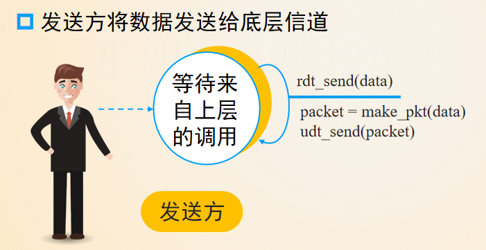
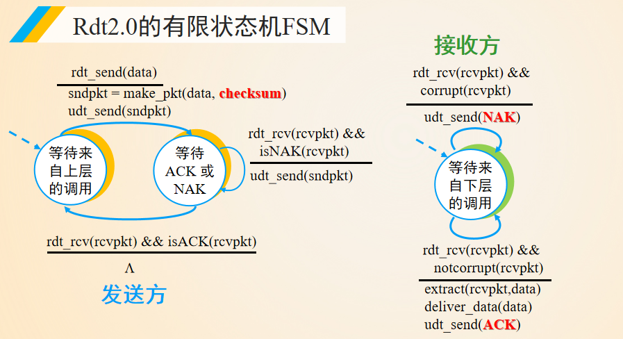
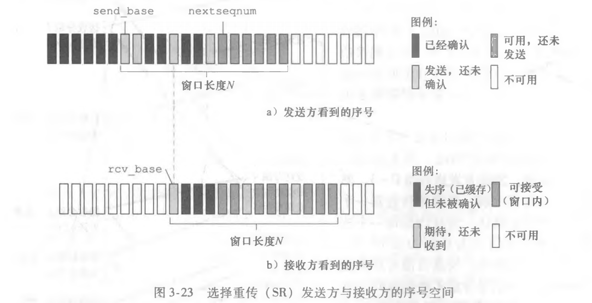
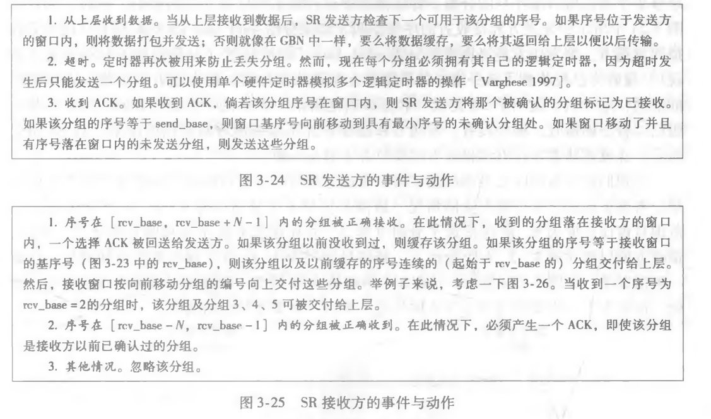

# 3.1 传输层服务

传输层协议为运行在不同Host上的**进程**提供了一种**逻辑通信协议**

传输层协议只工作在端系统上

## 多路复用和多路分用

* 复用：发送给网络层的时候要把不同线程的信息合起来
* 分解：接收多个线程的信息的时候，网络层只发送一个整合好的回来，自己把它分割给不同的线程

> 自顶向下中解释：
>
> 多路分解：将运输层报文段的数据交付到正确的套接字
>
> 多路复用：源主机从不同套接字中接受数据块，为每个数据块封装首部信息（用于以后分解）从而生成报文段，然后将报文段传递到网络层。

## UDP

* 基于Internet IP协议

  复用/分用

  简单错误校验（校验和）

* Best effort 服务，UDP段可能丢失/非按序到达

* 无连接

  UDP发送方与接收方不需要握手

  每个UDP段处理独立于其他段

UDP优势：无需建立连接，无需维护连接状态，段首部开销小，无拥塞控制，按需随时发送

## 可靠数据传输原理

### 可靠数据传输协议

* RDT 1.0:可靠信道上的可靠数据传输协议

  

* RDT 2.0:产生位错误的信道

  增加检查和checksum

  接收方利用确认机制显示告诉发送方分组是否正确

  ACK：正确接收 NAK：接受错误，**重传**分组

  基于**重传机制**的RDT协议称为ARQ协议

  > 如何实现重传：在缓冲区缓存已经发出但是还未收到反馈的报文段，接收方和发送方各一个报文段大小的缓冲区即可

  

* RDT 2.1：应对ACK/NAK信息被破坏

  解决重复分组问题：发送方给每个分组增加序列号，接收方就丢弃重复分组

* RDT2.2：只使用ACK，没有NAK

  接收方对**最后一个**正确收到的分组发送ACK，ACK中指明被确认分组的序号

  发送方收到重复的ACK当NAK处理

* RDT 3.0：信道既可能发生错误，也可能丢失分组

  发送方等待合理时间（定时器），未收到ACK就重传，发生错误就不做任何处理，等待超时了自然重传

  能工作，但性能很差，即网络协议限制了物理资源的利用
  
  > 提高性能的可行方法：流水线技术，运行发送方发送多个分组无需等待确认，双方必须对分组进行缓存

### 流水线可靠数据传输协议

流水线差错恢复：

* 回退N步（滑动窗口协议）：窗口长度必须小于或等于序号空间大小的一半

  发送方采取**累积确认**，计时器仅用一个，最早的已发送但还没确认的分组的定时器。超时，重传**所有已发送但还未确认过的分组**

  接收方只接受正确的顺序分组，乱序分组到达则**丢弃**

* 选择重传

  * 接收方确认正确接收分组，不管是否按序。**接收方窗口小于等于2的k-1次方**。

    **失序但在窗口内的分组**将被缓存到所有前面的丢失分组（序号更小的那些分组）皆被接收为止，

    如果接收的分组为rcv_base之前的N个序号，必须产生一个ACK，即使该分组是接收方以前已经确认过的分组

    其他情况丢失分组

  * 发送方每个分组拥有自己的逻辑定时器，超时只重传一个分组，收到ACK在窗口内就标记为已接收，直到send_base开始有连续的ack就更改send_base，**发送方窗口小于等于2的k次方-1**.

  

  

## 面向连接的运输:TCP

面向连接，全双工服务，点对点连接，有序可靠字节流，流量控制（关注接收方），拥塞控制（关注路由器这种网络核心的），流水线

### TCP连接

* 三次握手
* TCP协议只在端系统上运行，两台主机之间的网络元素（路由器，交换器和中继器）中，没有为该连接分配任何缓存和变量
* **累积确认**：TCP只确认该流中至第一个丢失字节为止的字节。eg：A收到B包含字节0~535和900~1000的报文段，返回给B的下一个报文段确认号字段包含536。
* 快速重传：如果发送方收到一个数据的重复三次ACK，会认为确认数据之后的报文段丢失，**在超时到来之前重传**

样本RTT：EstimatedRTT = (1- α)*EstimatedRTT + α * SampleRTT

波动误差：DevRTT = (1-beta)*DevRTT + beta|SampleRTT-EstimatedRTT|  (参考值, beta = 0.25)注意，第一次计算时，DevRTT=0.5 *SampleRTT

超时间隔：TimeoutInterval = EstimatedRTT + 4*DevRTT

### 流量控制

发送方的发送速率和接收方应用程序的读取速率相匹配，UDP没有提供流量控制

当接收方发回的RcvWindow=0时，发送方仍可发一个只有一个字节的报文段过去。

### 三次握手

1. 客户向服务器发**SYN报文段**（SYN置1），随机选择初始序号
2. 服务器从数据报中提取TCP SYN报文段，为TCP连接分配TCP缓存和变量（此处易受到SYN洪范的拒绝服务攻击），想客户TCO发送允许连接报文段，其中SYN比特置1，确认号字段为客户端**初始序号+1**，还有服务器自己的初始序号，该报文段被称为**SYNACK报文段**
3. 收到SYNACK报文段，客户也要为TCP连接分配缓存和变量，发送报文对服务器允许连接报文进行确认，其中确认字段为服务器初始序号+1，该报文、SYN比特置0。第三阶段可以再报文负载中携带客户到服务器的数据。

关闭TCP连接：FIN比特置1，客户发服务器，服务器接收。服务器再发FIN为1报文给客户。双方至此都对对方的终止报文段确认，TCP断开连接。

### 拥塞控制原理

**和流量控制不同，流量控制是接收方根据自己处理能力限制发送方发送，拥塞控制主要是网络资源的处理能力限制**

#### 拥塞产生代价

1. 分组到达速率接近链路容量，分组经历巨大排队时延
2. 发送方必须执行重传以不补偿因为缓存溢出而丢失的分组
3. 发送方在遇到大的时延时所进行的不必要重传会引起路由器利用其链路带宽来转发不必要分组副本
4. 当一个分组沿一条路径被丢弃时，每个上游路由器用于转发该分组到丢弃该分组而使用的传输容量最终被浪费掉了

#### 拥塞控制方法

* 端到端拥塞控制：端系统通过对网络行为（丢包或时延增加）的观测判断网络是否拥塞，网络层不提供任何帮助，**目前TCP采用该方法**
* 网络辅助的拥塞控制（网络路由器直接反馈和经由接收方的网络反馈）

#### 拥塞控制算法

1. 慢启动
2. 拥塞避免
3. 快速恢复（非必须）
