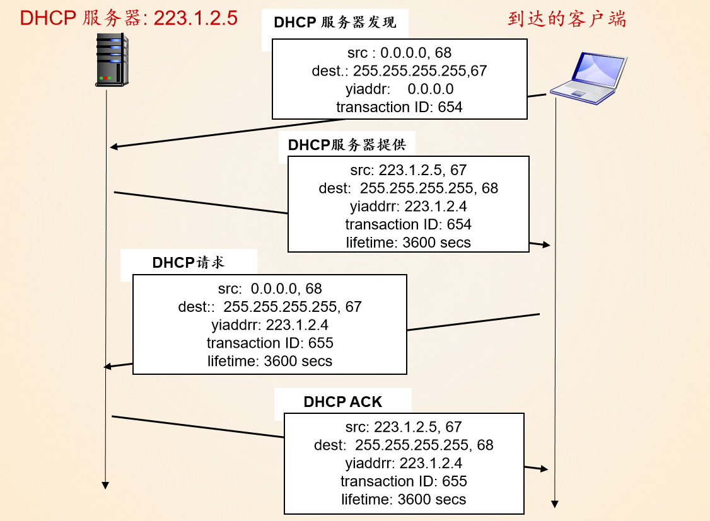
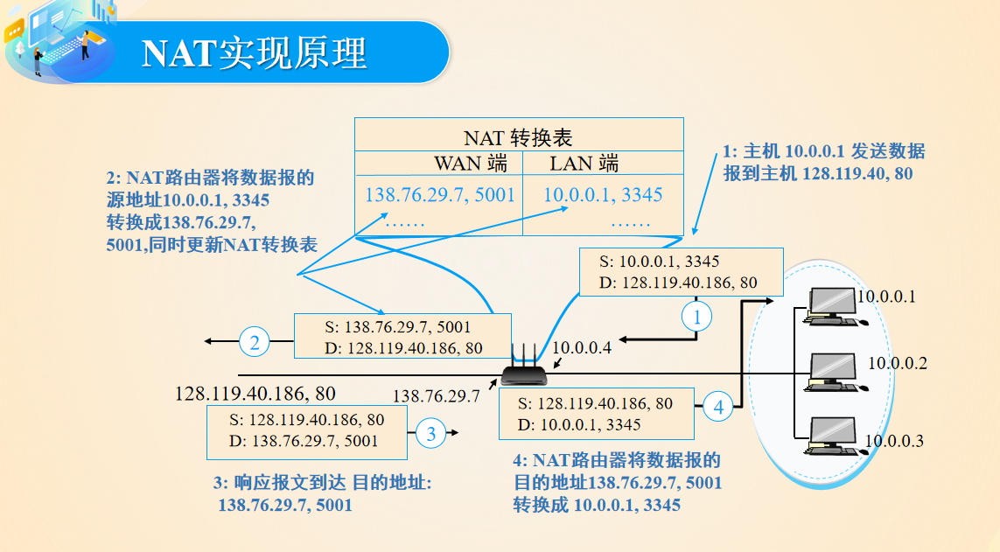

# 4.1 网络层概述

## 4.1.1转发和路由选择：数据平面和控制平面

1. 转发：将分组从一个输入链路接口转移到适当的输出链路接口的路由器本地动作（时间尺度很短，硬件实现）

   **转发是在数据平面中实现的唯一功能**

   转发服务：

   * 虚电路服务，需要建立连接，事先握手，路径上的每个路由器必须为进行中的连接维持连接状态信息
   * 数据报服务，没有建立连接过程，不维护连接状态信息，同一对主机间的报文可能会走不同路

   

2. 路由选择：确定分组从源到目的地所采取的端到端路径的网络范围处理过程（时间尺度较长，软件实现）

   **路由选择在控制平面中实现**

   路由选择的两种方法：

   1. 传统的方法：路由选择算法和协议
   2. SDN方法：远程控制器(软件)计算和分发转发表以供每台路由器使用

## 4.1.2 网络服务模型

**尽力而为服务**

分组交换机：

* 路由器（网络层）
* 链路层交换机

# 4.2 路由器工作原理

路由器结构：

* 输入端口
* 交换结构（路由器中的网络）
* 输出端口
* 路由选择器（执行控制平面功能）

## 4.2.1 输入端口处理：

转发表匹配原则：**最长前缀匹配规则**

## 4.2.2 交换

* 经内存交换

* 经总线交换

  所有输出端口都能收到分组，但只有匹配端口可以保存该分组

* 经互联网络交换

  能够并行转发多个分组，**非阻塞的**

## 4.2.4 排队

1. 输入排队（线路前部（HOL）阻塞）
2. 输出排队：主动队列管理算法解决，eg：随机早期检测RED

## 4.2.5 分组调度

* FIFO先进先出
* 优先权排队
* 循环和加权公平排队

# 4.3 网际协议

## 4.3.1 IPv4数据报格式

* 版本号 （确定IP协议版本）
* 首部长度
* 服务类型
* 数据报长度
* 标识，标志，片偏移（分片相关，IPv6不允许在路由器上对分组分片）
* 寿命（TTL）
* 协议（协议号是把网络层和运输层绑定到一起的黏合剂，类比端口号是运输层和应用层黏合剂）
* 首部检验和
* 源和目的IP地址
* 选项（允许IP首部被扩展）
* 数据（有效载荷）

## 4.3.2 IPv4数据报分片

一个链路层帧能承载的最大数据量：**最大传送单元（MTU）**

## 4.3.3 IPv4编制

IP地址表示：**点分十进制记法**

接口：

* 主机与物理链路之间的边界
* 路由器与它的任意一条链路之间的边界

**每个接口都有一个全球唯一的IP地址**

子网：为了确定网络区域，分开主机和路由器的每个接口，从而产生了若干个分离的网络岛，接口端连接了这些独立网络的端点。这些独立的网络岛叫做**子网(subnet)**

因特网地址分配策略：**无类别域间路由选择（CIDR）**

**IP广播地址255.255.255.255**

如何获取组织和主机地址：

1. 获取一块地址（组织）

   法一：从ISO中获取一组地址

   法二：向ICANN申请IP地址

2. 获取主机地址：动态主机配置协议**DHCP**

   DHCP是一个客户-服务器协议

   协议步骤：

   1. DHCP服务器的发现（**DHCP发现报文**）
   2. DHCP服务器提供
   3. DHCP请求
   4. DHCP ACK
   
   
   
   > DHCP协议不仅仅只能获取IP地址：
   >
   > * 网关地址
   > * DNS地址
   > * 子网掩码

## 4.3.4 网络地址转换

本地网络只需要一个IP地址就可以和外部网络相连

NAT使能路由器对外界隐藏了家庭网络的细节，内网主机对外网不可见不可寻址，一定程度上也算一种保护措施

NAT使能路由器通过NAT转换表切换WAN端和LAN端实现局域网和广域网的通信

外网主机无法主动访问内网主机

## 4.3.5 IPv6

* IPv6不允许在中间路由器上进行分片与重新组装
* IPv6不进行检验操作，没有首部检验和了
* 选项字段被放到“下一个首部”上了，IP首部成为40定长字节

IPv4到IPv6的迁移：建隧道（套娃，IPv4套IPv6数据报）

# 4.4 通用转发和SDN

通用转发：每台分组交换机包含一张**匹配加动作表**，该表由远程控制器计算和分发

匹配加动作表：

* 首部字段值集合：入分组与之匹配 
* 计数器集合：计数已经和该表项匹配的分组数量
* 动作集合：分组转发到给定输出端口；丢弃分组；复制分组；发送到多个输出端口；重写所选首部字段......

匹配加动作操作中的OpenFlow例子：

* 简单转发
* 负载均衡
* 充当防火墙

