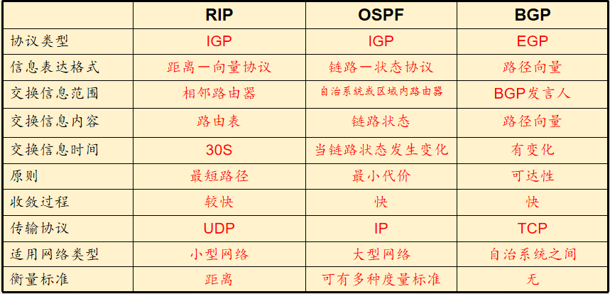

# 5.1 概述

控制的两种方法：

* 每路由器控制：在控制平面中各个路由选择算法组件相互作用
* 逻辑集中式控制：一个完全分开的（通常是远地的）控制器与本地控制代理（CA）交互

二者关键差异：**本地CA既不能直接相互交互，也不能主动参与计算转发表**

# 5.2 路由选择算法

分类方法一：

* 集中式路由选择算法：具有关于连通性和链路开销方面的完整信息

  eg：LS算法（链路状态算法）

* 分散式路由选择算法：路由器以迭代，分布式方法计算出最低开销路径，没有网络链路开销完整信息

  eg：DV算法（距离向量算法）

分类方法二：

* 静态路由选择算法

* 动态路由选择算法

  路由信息可以更快地发生变化

  周期性的更新

  可以响应拓扑或链路费用的变化

分类方法三：

* 负载敏感
* 负载迟钝（当前因特网路由选择算法都是）

## 5.2.1 链路状态路由选择算法（全局信息）

1. Dijkstra算法
2. Prim算法

防止拥塞敏感路由选择的震荡方法：确保并非所有路由器同时运行LS算法，让每台路由器发送链路通告的时间随机化

## 5.2.2 距离向量路由选择算法（分布式）

Bellman-Ford方程

1. 链路开销改变与链路故障

   当链路开销增加，且遇到路由选择环路的时候，链路开销增加的坏消息传播的很慢

2. 增加毒性逆转

   解决上述的问题

3. LS与DV路由选择算法比较（N:路由器节点集合；E：链路边的集合）

   * 报文复杂性

     LS算法：O（N*E）个报文

     DV：每次迭代两个邻居交换报文

   * 收敛速度

     DV比较慢，收敛会遇到路由选择环路，无穷计数等问题

   * 健壮性

     LS算法：路由器相对隔离，有一定健壮性

     DV算法：一个不正确的节点计算会传递到整个网络

* 好消息传得快
* 坏消息传得慢（无穷计数，路由环路）

# 5.3 因特网自治系统内部路由选择：OSPF

一般一个ISP中路由器及其链路构成一个自治系统（AS），一个自治系统具有全局唯一的AS号。

协议交互范围及方法

* OSPF协议消息限于本自治系统域内
* 协议消息采用洪范式发送

协议交互信息内容

* 与本路由器相邻的所有路由器的链路状态

协议交互时机

* 仅当链路状态发送变化时

* 开放最短路优先（OSPF）

  链路状态协议，洪泛链路状态信息，Dijkstra算法，OSFP报文由IP承载

  优点：

  1. 安全，可鉴别OSPF路由器间交换
  2. 多条相同开销路径允许同时使用
  3. 对单播与多播路由选择综合支持
  4. 支持在单个AS中的层次结构
  5. 快速收敛，一发生链路状态变化就再自治系统内发送消息

# 5.4 ISP之间的路由选择：BGP

**边界网关协议：BGP**

特点：分布式，异步

* 网关路由器：位于AS边缘，连接到其他AS中的一台或多台路由器
* 内部路由器：仅连接在它自己AS中的主机和路由器

BGP工作步骤：

1. 通告BGP路由信息

   向因特网的所有AS通告自身存在

2. 确定最好路由

   前缀+属性=**路由**

   重要属性：AS-PATH（已经通过的AS列表）；NEXT-HOP（起始的路由器接口的IP地址）

   1. 热土豆路由选择

      尽可能快地把分组送出其AS（最低开销）

   2. 路由器选择算法

      1. 路由被指定一个本地偏好
      2. 余下路由选择最短AS-PATH路径
      3. 热土豆路由选择
      4. BGP标识符

# 5.5 SDN控制平面

三大特性：集中化的管理，控制转发分离，开放的API

 SDN体系结构特征：

* 基于流的转发
* 数据平面与控制平面分离
* 网络控制功能
* 可编程的网络

SDN实体分为：**数据平面交换机，SDN控制器，网络控制应用程序**

## 5.5.1 SDN控制平面：SDN控制器和SDN网络控制应用程序

控制器自底向上可分为这几层：

* 通信层：SDN控制器和受控网络设备间的通信
* 网络范围状态管理层
* 对于网络控制应用程序层的接口

**SDN控制器和交换机通信通过OpenFlow协议，该协议运行在TCP之上**

# 5.7 网络管理和SNMP

网络管理框架：

*  管理服务器（应用程序）
* 被管设备（主机，路由器，交换机......）
* 管理信息库：储存被管设备中的每个被管对象的关联信息
* 网络管理代理：运行在被管设备中的一个进程，与管理服务器通信
* 网路管理协议：运行在管理服务器和被管设备之间（eg：SNMP）

因特网控制报文协议ICMP：被主机和路由器用来沟通网络层信息，典型用途是**差错报告**

> Ping和Traceroute都是利用ICMP实现的

SNMP是一个应用层协议

陷阱报文：代理向管理服务器发送的非请求报文，用于通知管理服务器异常情况，陷阱报文是异步产生的