# 7.1 概述

## 无线网络要素：

* 无线主机
* 无线链路
* 基站：负责与之相关联的无线主机发送数据和从主机那里接收数据，协调与之相关联的多个主机的传输。
* 网络基础设施，无线主机希望与之进行通信的更大网络。

## 无线网络分类

* 单跳，基于基础设施。网络**有**和较大有线网络连接的**基站**，该基站和所有无限主机之间的通信都经过**一个无线跳**。
* 单跳，无基础设施。不存在于无线网络相连的基站，一个节点可以协调其他节点的传输。eg：**蓝牙网络**。
* 多跳，基于基础设施。无线节点为了和基站通信要通过其他无线节点中继。eg：**无线网状网络**。
* 多跳，无基础设施。没基站，多跳，节点可能移动。eg：**移动自组织网络**，如**车载自组织网络**。

# 7.2 无线链路和网络特征

无线链路和有线的区别：递减的信号强度（**路径损耗**）；其他源的干扰（同一频段）；**多径传播**。

> 信噪比：收到的信号和噪声强度的相对检测，SNR = 20 * lg（信号振幅/噪声振幅）。

三种不同调制技术的比特差错率：信噪比越高，比特差错率越低，给定信噪比，比特传输率越高，比特差错率越大	

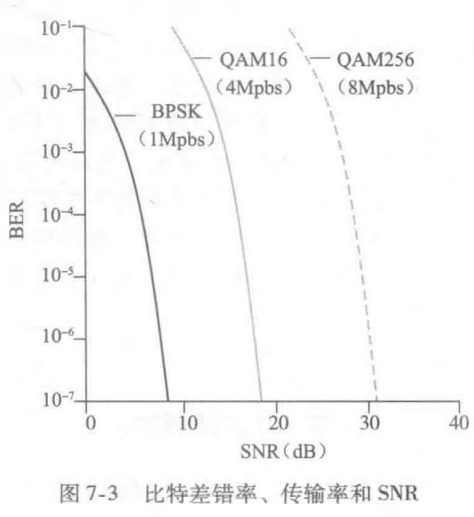

* **隐藏终端和信号强度衰减**使得多路访问在无线网络中复杂性远高于有线网络。

## CDMA码分多址

干扰情况下CDMA仍能获取来自发送方的数据，不管来自发送方2的干扰。（在假设干扰对传输比特信号是加性的情况下）

* 任何两个站点的码片向量规格化内积为0

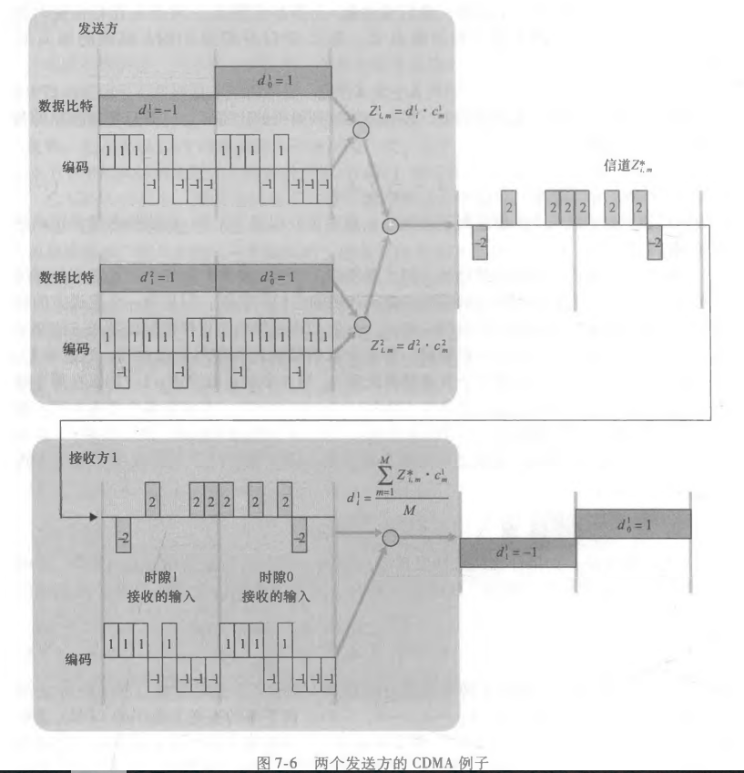

# 7.3 WiFi:802.11无线LAN

## 7.3.1 802.11体系结构

基本构建模块是**基本服务集（BSS）**，一个BSS包含多个**无线站点**和一个**接入点（AP）**，即中央基站。

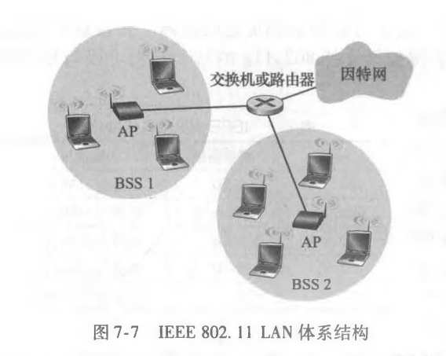

> 你的无线站点（手机，电脑...）如何知道哪个AP位于当前的**WiFi丛林**呢？
>
> 每个AP周期性发送**信标帧**，包含AP的SSID和MAC地址，无线站点扫描所有11个信道，找出可能位于该区域的AP发送的信标帧。

* 主动和被动扫描

  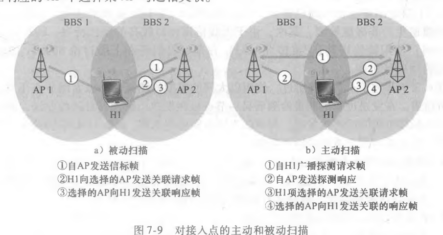

## 7.3.2 802.11MAC协议

> 802.11的MAC协议是**带碰撞避免的CSMA（CSMA/CA）**，和以太网的CSMA/CD有何异同？
>
> CSMA/CA和CSMA/CD都有载波侦听多路访问，但是802.11采用**碰撞避免而非碰撞检测**，其次，无线信道相对高的误比特率使得802.11使用不同于以太网的**链路层确认/重传（ARQ）**方案。

1. 处理隐藏终端：RTS和CTS

   RTS：请求发送帧

   CTS：允许发送帧

   发送方发DATA之前先发一个短RTS按时传输DATA帧和确认帧要的总时间，AP收到RTS后**广播CTS**作为响应：给发送方明确的发送许可，指示其他站点预约期内不要发送。

   * RTS和CTS虽然**有效降低碰撞**，但引入时延，消耗信道资源，所以仅用于长数据帧预约信道。实际应用可以设置RTS门限值来实现。

2. 使用802.11作为一个点对点链路

## 7.3.3 IEEE 802.11 帧

802.11帧中有**4个地址字段**：

地址1是接收该帧的站点的MAC地址，即**目的MAC地址**，即H1的MAC地址

地址2是传输该帧的站点的MAC地址，即**源MAC地址**，即图中AP的MAC地址

地址3是**路由器接口的MAC地址**，即R1的MAC地址

地址4用于**自组织模式中相互转发**。

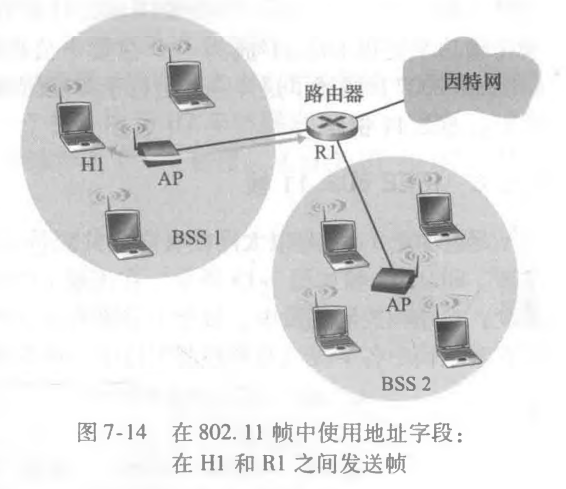

## 7.3.4 在相同IP子网中的移动性

H1逐步远离AP1，H1检测到AP1的信号逐渐减弱并开始扫描一个更强的信号，H1收到来自AP2 的信标帧，与AP1解除关联，并与AP2关联起来。在交换机中，使其意识到改变的方法：H1和AP2互联后，让AP2以H1的源地址向交换机发送一以太网广播帧，交换机收到后，更新转发表，使得H1可以通过AP2到达。

## 7.3.5 802.11中的高级特色

1. 802.11速率适应

   根据当前和近期信道特点来选择不同的物理层调制技术。确认帧多就提高传输速率，收到确认帧少就降低速率。

2. 功率管理

   通过功率管理比特的设置标识睡眠状态，设置节点的一个定时器，使得节点正好在AP计划发送它的信标帧前唤醒节点，睡眠期间任何发往睡眠主机的帧都被缓存。醒来后，AP发送信标帧，包括了帧被缓存在AP中的节点的列表。若某节点没有缓存的帧返回睡眠状态，有则发送探寻报文请求发送。这样99%时间都能睡眠。

## 7.3.6 个人域网络：蓝牙和ZigBee

1. 蓝牙

   工作在不需要许可的2.4GHz的无线电波段

   通过**调频扩展频谱**的信道伪随机跳动形式将传输扩展到整个频谱。

   自组织网络，组织生成一个**多达8个活动设备的皮克网**，指定一个主设备，其他为从设备，主设备确定时钟，每个奇数时隙发送，从设备仅在前一时隙和主设备通信后才可发送。还有可以多大255个**寄放设备**，被主节点从寄放转换为活动后可以通信。

2. ZigBee

   一个全功能设备和多个简化功能设备。全功能设备作为主设备运行.

   多个全功能设备还能配置为一个网状（mush）网络.全功能设备在它们之间发送帧.

## 7.4 蜂窝因特网的接入

### 7.4.1 蜂窝网体系概述

* 1G模拟FDMA系统，**专门用于语音通信**
* 2G除了语音还扩展了**对数据（即因特网）的支持**
* 3G更为强调**数据能力和更高速的无线电接入链路**
* 4G特征为**全IP核心网络，并以几兆比特的速率提供了话音和数据集成**

2G蜂窝系统的GSM标准对空中接口使用组合的FDM/TDM

总结：

* 一个蜂窝网覆盖的区域被分为许多个称为**小区（cell）**的地理覆盖区域，每个小区包含一个**收发基站BTS**，负责向位于其小区内的移动站点发送和接收信号；
* 一个GSM网络的**基站控制器BSC**服务于几十个收发基站，作用是为移动用户分配BTS无线信道，执行**寻呼**和**移动用户切换**

* 基站控制器和其控制的收发基站共同构成了**GSM基站系统**
* **移动交换中心MSC**在**用户鉴别和账户管理以及呼叫建立和转移**中起到决定性作用，单个MSC通常包含多达 5 个BSC，一个蜂窝提供商的网络将有若干个MSC，使用称为网关MSC的特殊MSC将提供商的蜂窝网络与更大的公共电话网相连接。

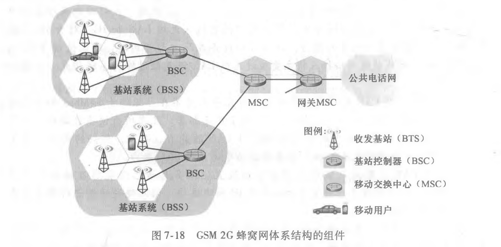

### 7.4.2 3G蜂窝数据网：将因特网扩展到蜂窝用户

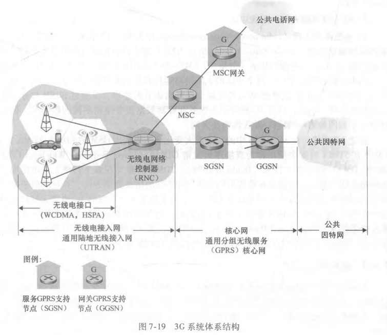

1. 3G核心网

   * 服务通用分组无线服务支持节点SGSN：向位于其连接的**无线电接入网中移动节点交付或者获取数据**，与MSC进行交互，提供用户认证和切换，维护活跃移动节点的位置（小区）信息，执行位于无线电接入网中的**移动节点和GGSN之间的数据报转发**

   * 网关GPRS支持节点GGSN：起着**网关**作用，将多个SGSN连接到更大因特网。

   > GPRS：通用分组无线服务

2. 3G无线电接入网：无线边缘

   无线电网络接入控制器**RNC控制着几个小区的收发基站**

   3GUMTS中不在用GSM的FDMA/TDMA，在TDMA中使用**直接序列宽带CDMA**，TDMA时隙又在多个频率上可供使用，使用了全部三种不同的信道共享方法。

> 尽管3G蜂窝语音服务和蜂窝数据服务使用不同核心网，但是它们共享一个相同的第一/最后一跳无线电接入网

### 7.4.3 走向4G：LTE

1. 4G系统体系结构：一个全IP核心网

   3G语音和数据流量具有分离的网络组件和路径，4G语音和数据都承载在IP数据报中，即“全IP的“。

   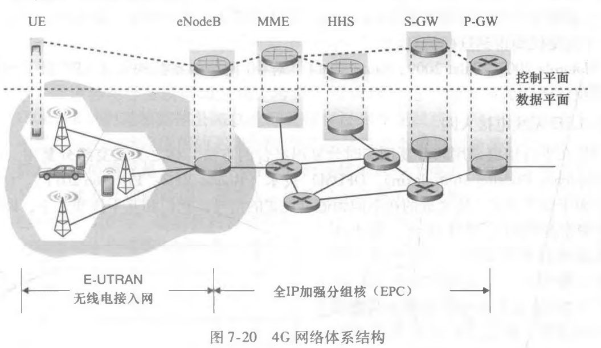

   * eNodeB:2G基站和3G无线电网控制器的逻辑后代，数据平面作用是**在用户设备UE和P-GW间转发数据报**。
   * 分组数据网络网关P-GW：**给UE分配IP地址**，并保证QoS实施。
   * 服务网关S-GW：数据平面移动性的锚点，所有UE流量将通过S-GW传递，也执行**收费/记账功能**和法定**流量拦截**
   * 移动性管理实体MME：代表所控制单元中的UE，执行连接和移动性管理。
   * 归属用户服务HHS：漫游接入能力，服务质量配置文件，鉴别信息的UE信息。

2. LTE无线接入网

   LTE在下行信道采用**频分复用和时分复用结合**，称为**正交频分复用**

## 7.5 移动管理：原理

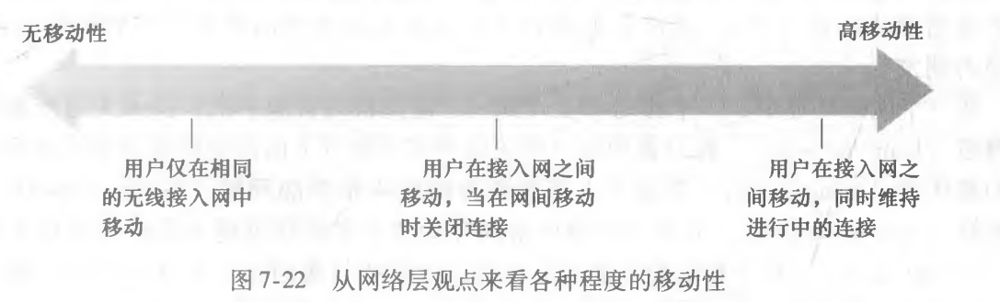

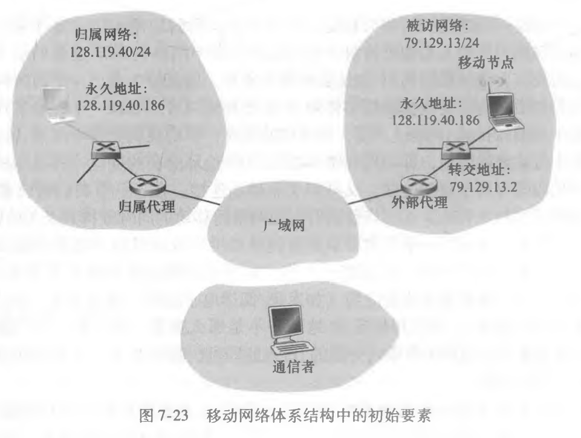

### 7.5.1 寻址

方法一（不实用）：

向所有其他网络发通告告诉它们该移动节点在它的网络中，且它有一条可将数据报路由选择到该移动节点的永久地址的正确路径。这些邻居在全网传播该路由选择信息，更新路由选择信息和转发表。

优点：不需要对网络层基础设施做重大改动

缺点：可扩展性差，路由器承担移动管理，需要维护太多移动节点转发表项。

法二（实际采用）：将移动性功能从网络核心搬到网络边缘

* 间接路由：通信者如果需要与移动用户通信, 归属代理首先截获这些数据报, 然后通过移动用户的COA将数据报转发给外部代理，然后从该外部代理转发给移动用户
* 直接路由：通信者获取移动用户的外部地址, 然后直接将数据报发给移动用户

外部代理作用：

1. **为移动节点创造转交地址COA**，一个移动节点同时和**永久地址和外部地址**管理
2. **告诉归属代理**，该移动节点在它的网络中且具有给定COA

### 7.5.2 路由选择到移动节点

1. 移动节点的间接路由选择

   通信者发给移动节点：

   通信者只负责发送数据报到移动节点固定地址，归属代理截取数据报，使用移动节点COA发送给外部代理，外部代理在转发给移动节点。

   移动节点发给通信者：以永久地址作为源地址，通信者地址作为目的地址直接发回去

   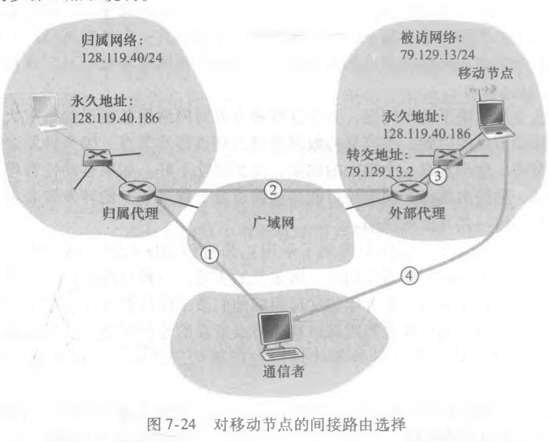

2. 移动节点的直接路由选择

   克服间接选择的**三角路由选择问题**

   通信者代理向归属代理查询移动节点的COA，直接将数据报发往移动节点的COA

​		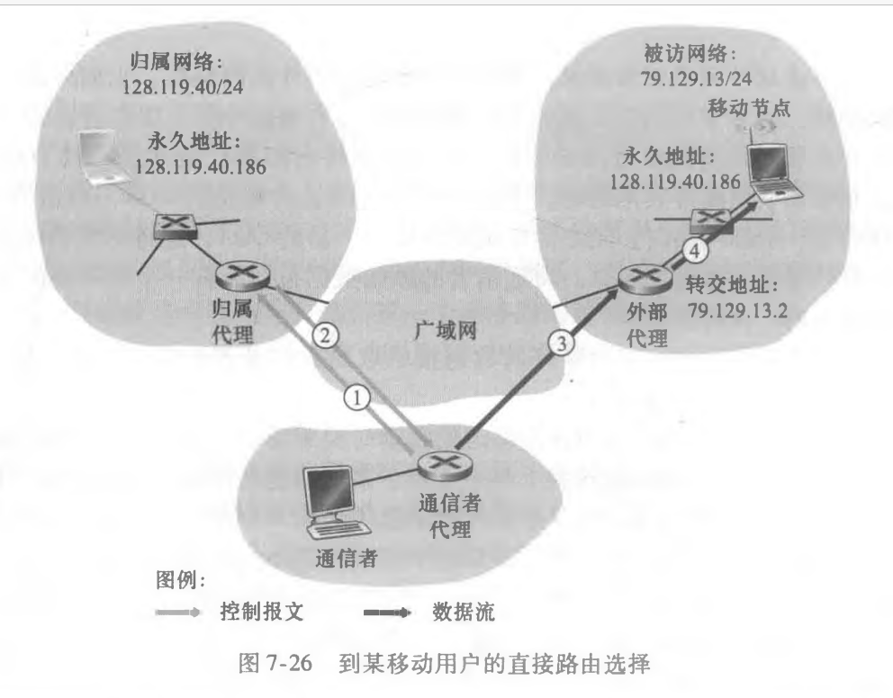

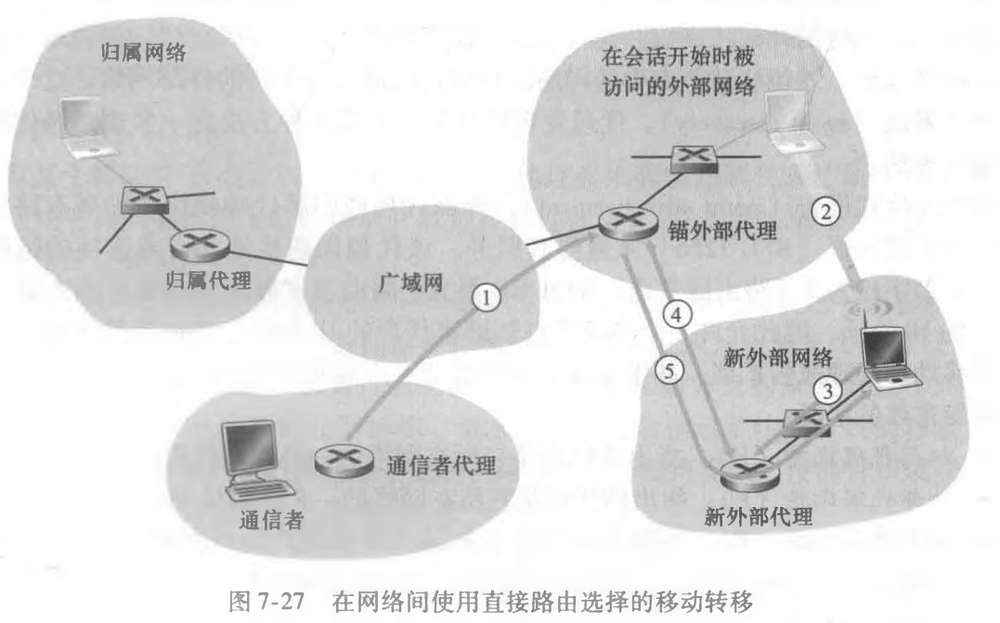

## 7.6 移动IP

1. 代理发现

   到达新网络的移动IP节点需要知道该网络的外部代理或者归属代理的身份。

   代理发现的两种方法：

   1. **代理通告**，外部或者归属代理周期性向所有连接的链路**广播一个路由器发现的ICMP报文**，包含该代理IP地址，因此移动节点可以获取该代理的IP地址
   2. **代理请求**，**移动节点广播代理请求报文**，收到请求的代理直接向该节点单播一个代理通告

2. 向归属代理注册

   1. 移动节点收到外部代理通告，马上**向外部代理发送移动IP注册**

   2. 外部代理收到注册报文，**记录移动节点永久IP地址，向归属代理434端口发送移动IP注册报文**

   3. 归属代理接收注册请求并检查真实性和正确性，把移动节点的永久IP地址与COA绑定

   4. 外部代理接收注册响应，将其转发给移动节点

      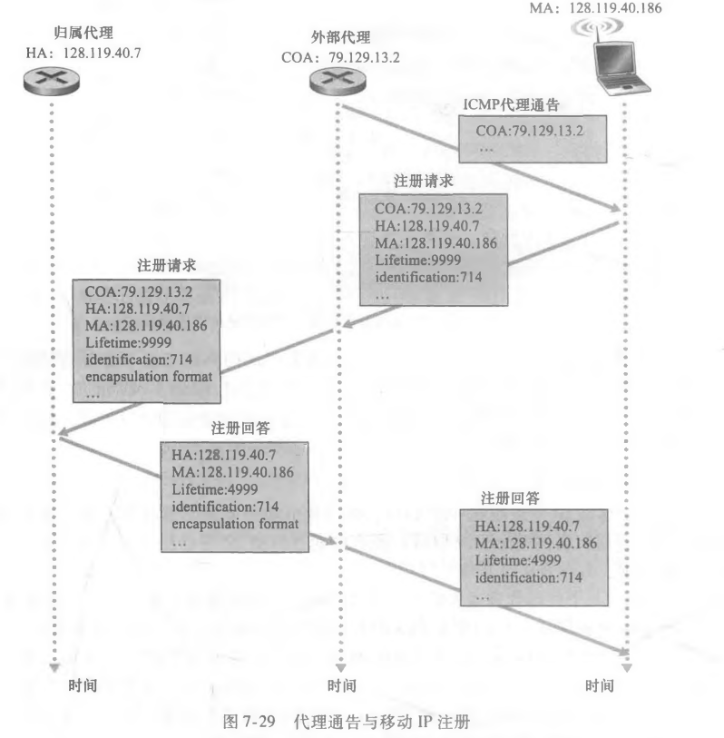

> 当某移动节点离开旧网络到新网络注册新COA的时候，原网络的外部代理自动注销旧的COA注册，无需显式取消

## 7.7 管理蜂窝网中的移动性

归属位置注册器HLR

网关移动服务交换中心：归属MSC

访问者位置注册VLR

### 7.7.1 对移动用户呼叫的路由选择

1. 通信者拨打移动用户的电话号码

2. 归属MSC收到该呼叫并查询HLR确定移动用户位置，返回移动站点**漫游号码**

   > 漫游号码是一个移动用户进入被访网络时，网络临时分配给用用户的号码，与用户的永久电话号码不同
   >
   > 漫游号码的作用与移动IP中转交地址作用类似

3. 给定一个漫游号码，归属MSC通过网络到达被访网络的MSC建立呼叫第二步。

至此呼叫完成，从通信者到归属MSC，再从归属MSC到被访MSC，然后到为移动用户提供服务的基站

> HLR如何获取移动用户位置信息？
>
> 移动电话进入新VLR覆盖的被访网络，必须向被访网络注册，通过移动用户与VLR交换信令报文实现。被访VLR随后又向移动用户HLR发送位置更新请求报文，告诉HLR漫游号码或者用来查询移动号码的VLR地址。

### 7.7.2 GSM中的切换

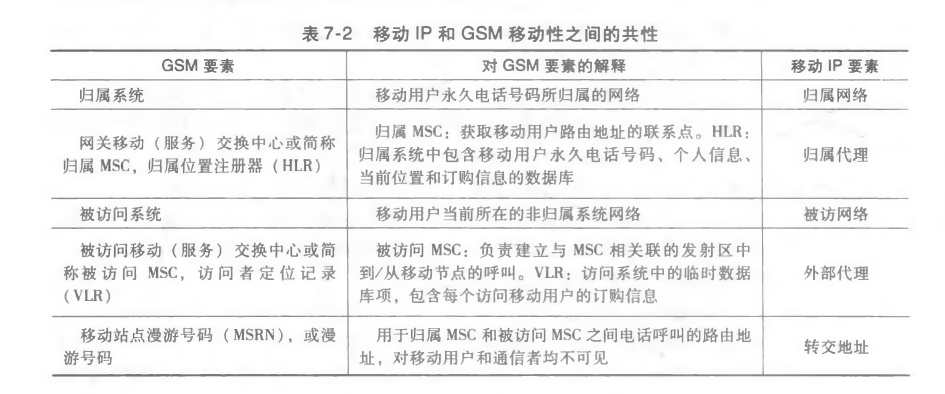

## 7.8 无线和移动性：对高层协议的影响

#### 对运输层影响

解决无线信道高比特差错率和切换丢失的可能性导致的TCP拥塞控制反应的问题：

* 本地恢复

* TCP发送方知晓无线链路

  区分有线网络中发生的拥塞性丢包和无线网络中的差错/丢包，仅对有线网络中的拥塞性丢包采用拥塞控制

* 分离连接方法

  移动用户和其他端点连接分成两个运输层连接：

  1. 移动主机到无线接入点
  2. 无线接入点到其他通信端点

  由此端到端的连接变成一个无线部分和一个优先部分分级连形参的。

#### 对应用层影响

无线链路的带宽较低，要将带宽作为稀有物品对待

