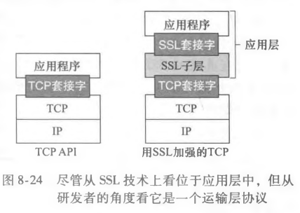
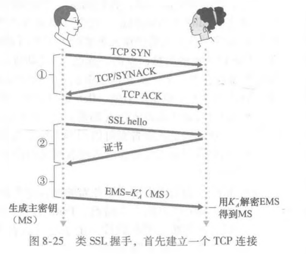
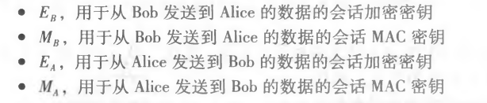
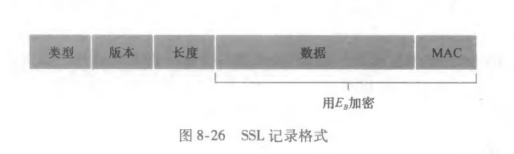
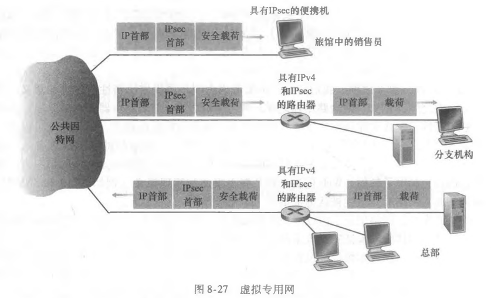
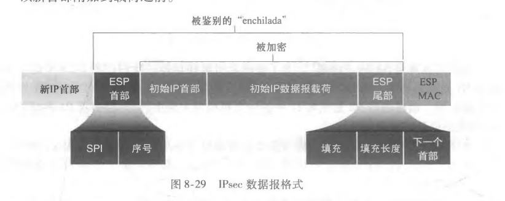
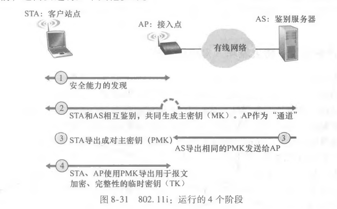
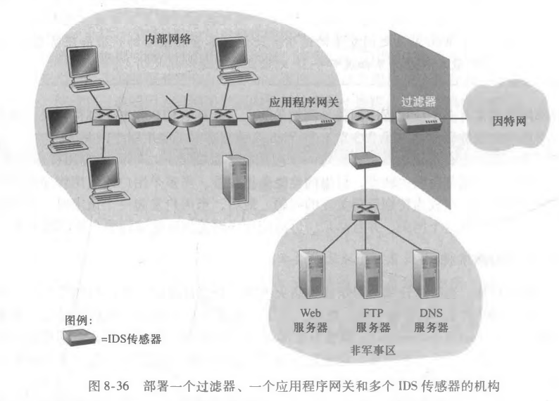

密码块链接CBC：基本思想是进随第一个报文发送一个随机值，然后让发送方和接收方使用计算的编码快代替后续的随机数

### 公开密钥加密

每个人都有两个密钥，一个是所有人都知道的公钥k+，一个是只有自己知道的私钥k-，所有人可以通过k+和某种公知的加密算法向自己发送报文m，自己用一个所有人都知道的解密算法解密，即：k-（k+（m））= m

1. RSA算法
2. 会话密钥：利用RSA发送一个加密的密钥给另一方，另一方解密，获得该密钥，该密钥是他们在后续过程中使用的对称共享密钥。

> RSA这么好，为什么还要使用会话密钥？
>
> RSA所要求的指数运算相当耗费时间，DES用硬件实现比RSA快100倍，用硬件则要快1000-10000倍。大大提升了传输长报文的效率。

## 报文完整性和数字签名

### 密码散列函数

1. MD5散列算法：
   1. 填充：先填1，然后填足够多的0，直到报文长度满足一定的条件
   2. 添加：在填充前添加一个用64比特标识的报文长度
   3. 初始化累加器
   4. 循环：对报文的16字块进行4轮处理
2. SHA-1算法

### 报文鉴别码

* 鉴别密钥：a生成报文m，用**鉴别密钥** s 级联 m，计算散列H（s+m），称之为**报文鉴别码MAC**，将其附到报文m，发送（m,H(s+m)）给b，b知道s，根据m和s算出H（s+m）对比是否相同。

### 数字签名

用自己的**私钥进行加密**，对方用**公钥可以解出**明文值。为了减少计算量，**对报文的散列进行签名**（散列函数是一个多对一函数）而不是对报文本身进行签名。

* 公钥认证：认证中心CA将公钥与特定的实体绑定，生成**证书**。CA用自己的私钥对这个证书进行数字签名。

## 端点鉴别

### 鉴别协议 ap2.0

把用于通信的周知IP地址用来鉴别身份。

### 鉴别协议 ap3.0

使用**秘密口令**，可以通过窃听通信获取口令。

### 鉴别协议 ap3.1

加密口令，仍可以通过窃听通信获得加密后的口令以伪装身份。称之为**回放攻击**。

### 鉴别协议 ap4.0

* 不重数：在一个协议的生存期只使用一次的数字。

接收方收到发送方声明身份后，向发送方发送一个**不重数R**，然后发送方用和接收方共享的**对称秘密密钥加密 R**，发送回来，使得接收方知道收到的报文是发送方的，**且发送方仍活跃**。接收方解密对比不重数，鉴别身份。

## 安全电子邮件（应用层安全性）

> 为什么仅在网络层提供安全性功能不能确保安全性呢？
>
> 1. 网络层提供安全性不能保证用户级的安全性，如商业站点不能依赖IP层安全性鉴别在该站点购买商品的用户
> 2. 协议栈的较高层上部署新的因特网服务（包括安全性服务）通常较为容易，而在网络层广泛部署安全性还需要若干年才能解决。

设计一个提供**机密性，发送方鉴别和报文完整性**的电子邮件系统：

1. 发送方首先生成一个**预备包**，其中包含他的**初始报文和该报文数字签名过的散列**

2. 把该预备包看成报文，选择一个**随机对称会话密钥加密该报文**，用**接收方的公钥加密这个对称密钥**，级联加密报文和加密密钥发送给接收方。
3. 接收方收到报文后用**自己的私钥解密得到对称密钥**，再用**对称密钥解密报文**
4. 解密后的报文用**发送方公钥应用到被签名的报文摘要**，将**结果和他自己对该报的散列进行比较**。

此过程发送方和接收方都用了两次公开密钥密码：一次自己的私钥用于数字签名/解密公钥，一次对方的公钥用于解密数字签名/加密对称密钥。

该系统仍要解决的问题：**安全分发公钥**，使对方得到的公钥确实是自己的。

**解决方案：CA验证该公钥**

安全电子邮件范例：PGP

## 使TCP连接安全：SSL（运输层安全性）

### 宏观描述：

1. 握手

   1. 建立TCP连接
   2. 验证对方身份
   3. 发送主密钥（用对方公钥加密，仅用于这个SSL会话）

   

2. 密钥导出

   发送方和接收方都用4个MS生成的密钥：

   

3. 数据传输

   SSL将数据分割成记录，对每个记录附加MAC用于检查完整性，然后用会话加密密钥加密该”记录+MAC“，Bob为了产生该MAC，将**数据连同密钥MB和序号**放入散列函数，加密后的包经TCP传输。序号的存在阻止了如重排序和重放报文等中间人攻击。

4. SSL记录

   

### 更完整的描述：

1. SSL握手

   1. 客户发送他支持的**密码算法的序列**，连同一个**客户的不重数**
   2. 服务器从列表中**选一种对称算法**（如AES），**一种公钥算法和一种MAC算法**，把**选择，证书和服务器的不重数**返回给客户
   3. 客户验证证书，提取服务器公钥，生成**前主密钥PMS**，用服务器公钥加密PMS，发送给服务器
   4. 用相同密钥导出函数，客户和服务器**独立地**从PMS和不重数中计算出**主密钥MS**，随后MS被切片成两个密码和两个MAC密钥（还可能有两个初始化向量，如果用在CBC），自此客户和服务器间的所有报文均被加密和鉴别
   5. 客户发送所有握手报文的一个MAC
   6. 服务器发送所有报文的一个MAC

   5，6用于防止握手被篡改，SSL中**不重数用于防御”连接重放“，序号用于防御在一个进行的会话中重放个别分组**

2. 连接关闭

   在SSL类型字段中指出该记录是否用于终止该SSL会话，虽然类型字段不加密，但是接收方会用记录的MAC对它进行鉴别。

## IPsec协议（网络层安全性）

### IPsec和VPN

* 专用网络：机构自己搭建的IP网络，有自己的路由器，链路，DNS基础设施且**与公共因特网完全分离**。

* VPN虚拟专用网：在现在又的公共因特网上创建的，机构办公室间流量经公共因特网发送，只是在**流量进入公共因特网之前要加密**

  

### AH协议和ESP协议

IPsec协议族中两个主要协议：

* 鉴别首部（AH）协议：提供**源鉴别和数据完整性服务，不提供机密性服务**
* 封装安全性载荷（ESP）协议：提供**源鉴别，数据完整性和机密性服务**

### 安全关联

在源实体向目的实体发送IPsec数据报之前，源和目的实体创建了一个网络层的逻辑连接，这个逻辑连接称之为**安全关联（SA）**

* SA是单工逻辑连接，从源到目的是**单向的**
* 两个实体互相发送安全数据报要创建两个SA
* SA的状态信息包括：
  * 安全参数索引**SPI**
  * 初始接口和目的接口
  * 加密类型
  * 加密密钥
  * 完整性检查类型
  * 鉴别密钥
* 一个IPsec实体在它的**安全关联数据库SAD**中储存所有SA的状态信息，SAD是实体操作系统内核的一个数据结构

### IPsec数据报

* IPsec有两种分组模式：**隧道模式和运输模式**

* IPsec实体维护一个名为**安全策略库SPD**的数据结构，指示哪些类型的数据报将被IPsec处理，并且对于这些将被IPsec处理的数据报使用哪个SA。

  >SPD中的信息指示对一个到来的数据报“做什么”，SAD中的信息指示“怎样做”。

### IKE：IPsec中的密钥管理

* 因特网密钥交换协议IKE：

  每个IPsec实体都有一个证书，包含了该实体的公开密钥，IKE协议让两个实体交换证书，协商鉴别和加密算法，安全地交换用与在IPsec SA中生成的会话密钥的密钥材料

## 使无线LAN安全

### 有线等效保密

1. 无线主机通过接入点请求鉴别
2. 接入点以一个128字节不重数值响应鉴别
3. 无线主机用它与这个接入点共享的密钥加密这个不重数值
4. 接入点解密主机加密的不重数值

802.11i：

## 运行安全性：防火墙和入侵检测系统

### 防火墙

防火墙是一个硬件和软件的结合体，它具有三个目标：

* 从内到外和从外到内的流量都要通过防火墙
* 仅被授权的流量允许通过
* 防火墙自身免于渗透

防火墙可以分为三类：

1. 传统分组过滤器

   独立检查每个数据报，基于管理员规则决定数据报是否通过
   
2. 状态分组过滤器

3. 应用程序网关

   一个应用程序特定 的服务器，所有应用程序数据都要通过它

   缺陷：

   * 每个应用程序都要一个不同的网关
   * 所有数据通过网关发送，性能负担重
   * 用户发起请求，客户软件必须知道如何联系网关，并告诉网关如何连接到哪个外部服务器

### 入侵检测系统

**入侵检测系统IDS**观察到恶意流量会进行**告警**，滤除可疑流量的称之为**入侵防止系统IBS**

IDS系统是IPS和IDS的统称

> 为何使用多个IDS传感器？为什么不只在分组过滤器后面放一个或者和分组过滤器综合？
>
> 深度分组检查：查看首部字段以外的部分，深度查看分组携带的应用数据
>
> IDS不仅要进行**深度分组检查**，还要对每个过往的分组和数以万计的特征进行比较，可能导致极大处理量，所以将IDS传感器下方放到下游，每个传感器仅看到该机构流量一部分，维护更容易。

IDS系统分类：

* 基于特征的系统
  * 维护了一个范围广泛的攻击特征数据库
  * 将每个嗅探的分组和数据库特征比较，若是匹配，产生告警
  * 缺点：
    1. 对不得不记录的新攻击缺乏判断力
    2. 即使与特征匹配，也可能不是一个攻击的结果，产生虚假告警
    3. 每个分组要和范围广泛的特征及和相比较，IDS可能处于处理过载状态并因此难以检测出许多恶意分组
* 基于异常的系统
  * 运行时，生成一个流量概况文件，寻找统计上不寻常的分组流
  * 区分正常流量和统计异常流量是一个很大的挑战

