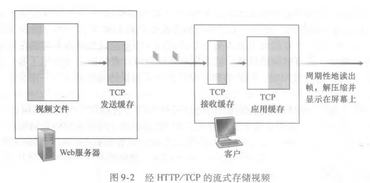
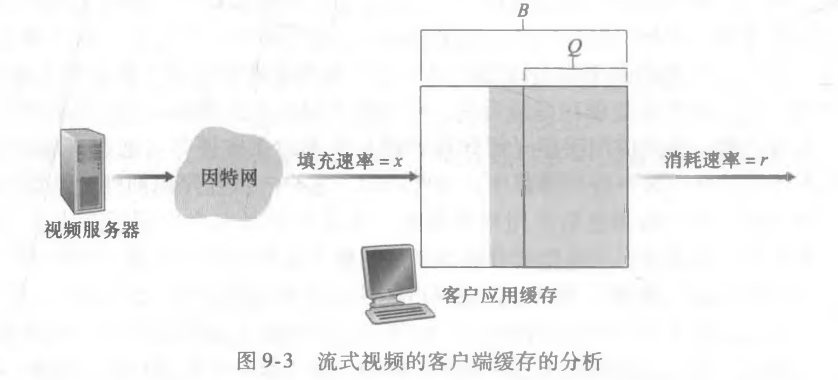
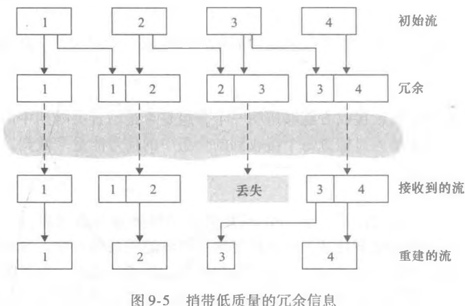
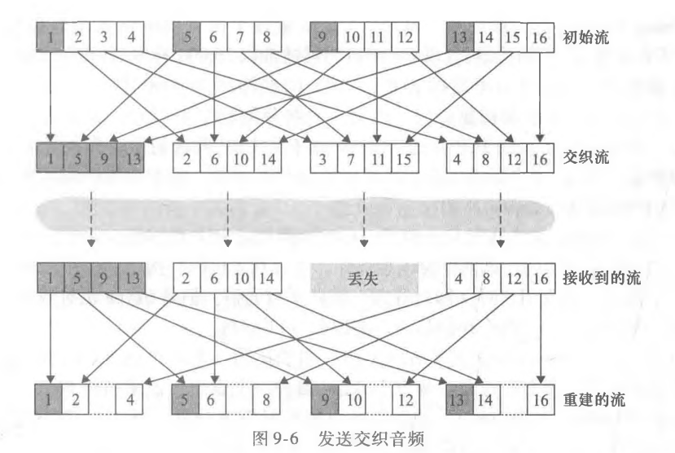
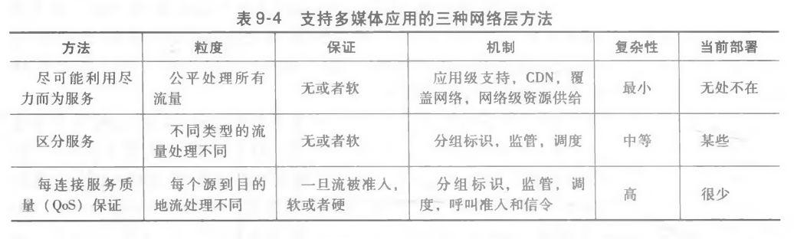

## 9.1 多媒体网络应用

### 9.1.1 视频的性质

视频压缩：

* 空间冗余
* 时域冗余

### 9.1.2 音频的性质

* 脉冲编码调制PCM

* MP3：接近CD质量立体声乐的流行压缩技术
* AAC：高级音频编码

### 9.1.3 多媒体网络应用类型

1. 流式存储音频/视频
   * 流：边看边接收后续部分
   * 相互作用：暂停，前进，倒退
   * 连续播放
2. 会话式IP语音/视频
   * 时延敏感
   * 容忍丢包
3. 流式实况音频/视频

## 9.2 流式存储视频

### 9.2.1 UDP流

* UDP未采用拥塞控制，服务器能以视频消耗的速率讲分组推进网络中，无TCP的速率控制的限制。
* 除服务器到客户的视频流之外，两者间还并行地维护一个单独的控制连接，通过该链接客户可以发送有关状态变化的命令（暂停，重新开始等）
* 不足：
  * 由于服务器和控制之间带宽不可预测且变化，恒定速率UDP不能提供连续播放
  * 要求RSTP服务器跟踪每个客户状态，处理每个客户请求
  * 防火墙阻塞UDP流量

### 9.2.2 HTTP流

1. 预取视频

2. 客户应用缓存和TCP缓存

   

   在用HTTP流时，一个满的客户应用缓存间接对服务器到客户能够发送的视频速率施加限制

3. 流式视频分析

   

   Q:客户应用缓存开始播放前必须被缓存的比特数

   当x<r时，播放将在连续播放器和停滞播放期（客户应用缓存排空，等待继续装到Q）间进行变动

   当x>r时，在初始缓存时延后，用户将享受连续播放直到视频结束

4. 视频的早期中止和重定位

   在用户利用HTTP GET报文中的HTTP字节范围首部来重定位到未来某个点或者提前终止时，有服务器发送的已经预取但还未观看的数据将不会被观看，导致**网络带宽和网络资源的浪费**

## 9.3 IP语音（VoIP）

### 9.3.1 尽力而为服务的限制

1. 丢包

   UDP报文段在从发送方到接收方的一个或者多个缓存可能是满的，导致无法接收该IP数据报，并将其丢弃

   > 为啥不用TCP来实现可靠数据传输避免丢包捏？
   >
   > 因为TCP重传机制增加了端到端时延，拥塞控制可能导致传送速率将到低于接收方排空速率，导致缓存“饥饿”，对接收方语音可理解度产生严重影响。所以，**除非是用于位于阻碍UDP的NAT或者防火墙后**，不然语音通话一般都用UDP。

2. 端到端时延

   端到端时延由这几点构成：

   * 路由器中的传输，处理和排队时延
   * 链路中的传播时延和端系统的处理时延

3. 分组时延抖动

   由于不同分组可能在路由器上经历不同的排队时延（一个去的时候没排队，一个去的时候大家都在排队）

   时延抖动可以用**序号，时间戳和播放时延**来消除

### 9.3.2 在接收方消除音频的时延抖动

结合时间戳和延迟播放机制完成

1. 固定播放时延
2. 适应性播放时延

### 9.3.3 从丢包中恢复

1. 向前纠错FEC

   基本思想：给初始的分组流增加冗余信息，以稍微增加传输速率为代价，冗余信息可用于重建一些丢失分组的近似或准确版本

   * 法一：每发送n个块，发送一个冗余编码的块，该块异或n个初始块获得，仅能重建一组丢失情况，通过权衡对丢失分组恢复和传输速率来调整n

   * 法二：发送一个较低分辨率的音频流作为冗余信息

     发送方通过从标称流中取出第n个块并附加上第n-1个块的 冗余信息，以构建第n个分组，这样只要没有连续分组丢失就都能用播放地址栏块来隐藏丢失。

     

     > 想用这个方法处理连续分组丢失怎么办？
     >
     > 可以让发送方不仅仅为第n个块附上第n-1个低比特率块，而是附上n-1和n-2个低比特率块等等

2. 交织

   发送方在传输之前对音频数据单元重新排序。使得最初相邻的单元在传输流中以一定的距离分离开来。稍微减轻丢包影响

   

   * 不增加流的带宽需求，增加了时延

3. 差错掩盖

   试图为丢失分组产生一个与初始分组类似的替代物（音频信号呈现大量**短期自相似性**），适用于小丢包率和小分组的情况

   基于接收方的恢复：

   * 分组重复：直接重复丢失前到达的分组的副本，计算复杂度低
   * 内插法：用在丢失之前和之后的音频内插形成合适分组来隐藏丢失，效果好，但计算强度大

### 9.3.4 学习案例：使用Skype的VoIP

## 9.4 实时会话式应用的协议

### 9.4.1 RTP

1. RTP基础
   * 运行在UDP上
   * RTP封装的东西仅为端系统所见，不提供任何机制保证数据及时交付，不保证服务治理，不保证分组的交付或失序交付
   * 音频视频和编码器捆绑时，一个方向只产生一个RTP流

### 9.4.2 会话发起协议SIP

* 提供了在主叫者和被叫者之间经IP网络创建呼叫的机制
* 提供主叫者确定被叫者的当前IP地址的机制
* 提供了用于呼叫管理的机制

## 9.5 支持多媒体的网络

能够对多媒体应用提供网络层支持的三种宽泛的方法：

* 尽可能利用尽力而为的服务
* 区分服务
* 每连接服务质量（QoS）保证

#### 提供多类型网络服务机制

* 标记分组：使得路由器区分属于不同流量类型的分组
* 流量隔离：使用流量监管或者为每种类型明确分配固定量的链路带宽的逻辑隔离来避免一类流量受到另一类异常流量影响
* 为流量类型或者流之间提供隔离，尽可能有效使用资源（如链路带宽和缓存）

#### 调度机制

#### 监管：漏桶机制

#### 漏桶+加权公平排队=队列中可证明的最大时延
