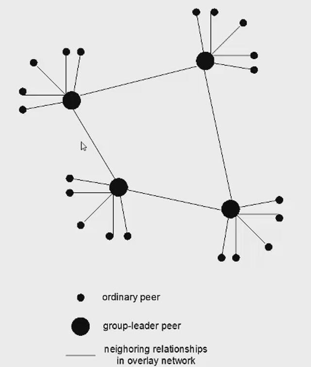
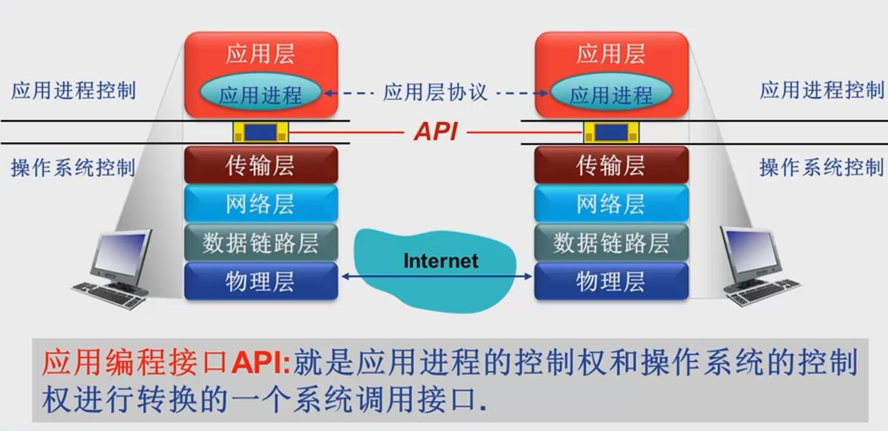
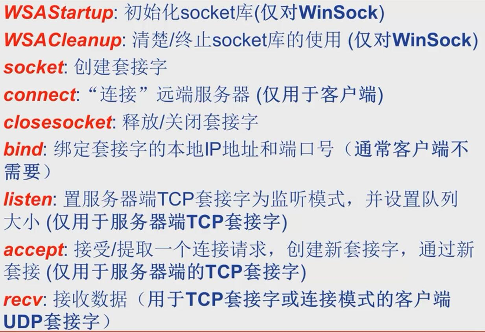
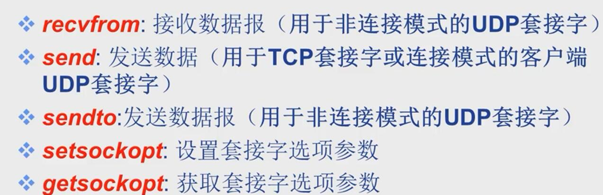
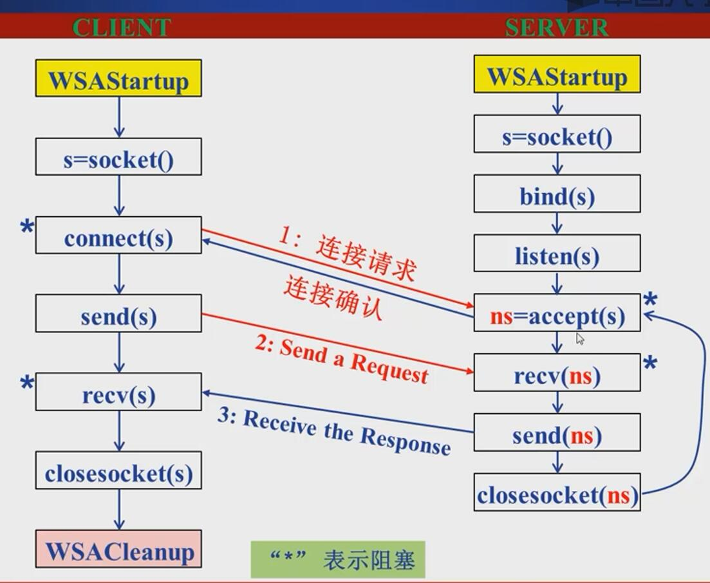
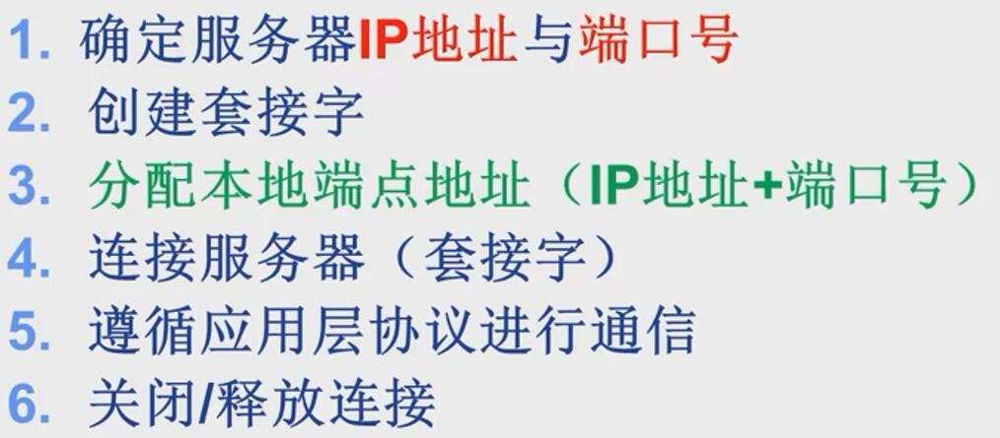
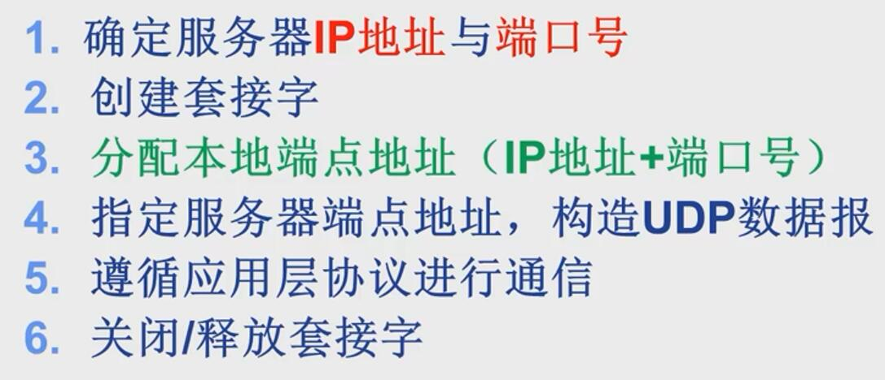
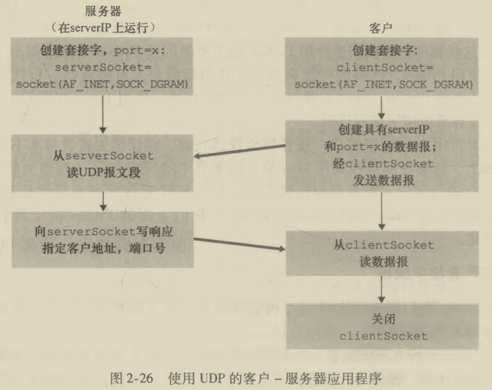
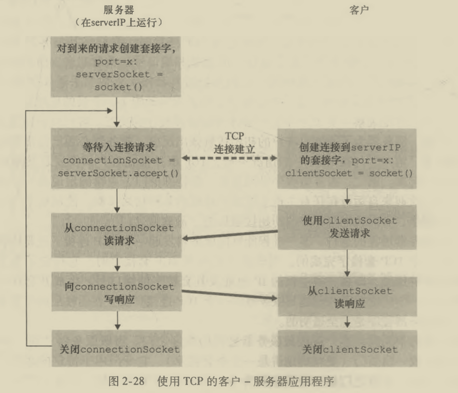

# 2.1 网络应用（层）内容概述

## 运输层协议提供给应用程序的服务

* 可靠数据传输
* 吞吐量
* 定时
* 安全性

因特网一般为应用程序提供两个传输层协议，即UDP和TCP

# 2.2 网络应用的基本原理

## 网络应用的体系结构

* 客户机/服务器结构（CS结构）（eg：Web）
* P2P（Peer to Peer）结构（eg：文件共享）
* 混合结构

## 网络应用进程间通信与应用层服务

## 网络应用的需求与传输层服务

网络应用对传输服务的需求：

* 数据丢失/可靠性
* 时间/延迟
* 带宽

Internet提供的传输服务

* TCP服务：面向连接，可靠的传输，流量、拥塞控制
* UDP服务：无连接，不可靠的数据传输

# 2.3 Web应用

## HTTP概述

* C/S（客户-服务器）结构

* 使用TCP传输服务

* HTTP是无状态协议：服务器不维护任何有关客户端过去所发请求的信息

## HTTP连接两种类型

1. 非持久性连接（每个TCP连接最多传输一个对象）
2. 持久性连接（TCP连接可传输多个对象）
   * 无流水的持久性连接（每个被引用对象花一个RTT）
   * 有流水机制的持久性连接（所有被引用对象花大约一个RTT）

> RTT(Round Trip Time)：客户端发一个小数据包到服务器并返回经历的时间

## HTTP消息格式

## Cookie技术

方便你一键登录，方便给你推荐你喜欢的东西的技术

## Web缓存/代理服务器技术

* 功能：再不访问服务器的前提下满足客户端的HTTP请求
* 利用条件性 get 方法保证缓存里面是最新的版本。

# 2.4 Email 应用

构成组件：

* 邮件客户端

* 邮件服务器

* **SMTP**协议（简单邮件传输协议）

  依赖于TCP协议进行可靠传输

  采用命令/响应交互模式

  端口 25

* MIME 多媒体扩展

* 邮件访问协议（从服务器获取邮件）
  * POP（无状态）
  * IMAP(有状态)
  * HTTP（一般在Web上访问邮件都用HTTP）

# 2.5 DNS应用

* 分布式层次式数据库
* **Internet核心功能，用应用层协议实现**

## DNS服务

* 域名向IP地址翻译
* 主机别名
* 邮件服务器别名
* 负载分配：如冗余的Web服务器

本地域名服务器作为代理帮主机发送和接受信息

### DNS查询

* 迭代查询
* 递归查询

### DNS记录缓存和更新

* 只要域名解析服务器获得域名-IP映射，即**缓存**这一映射

## DNS记录和消息格式

（name , value , type , ttl）

> DNS在区域传输的时候用TCP协议，其他时候用UDP协议

# 2.6 P2P应用

## BitTorrent

* 获取chunk：查询每个邻居有的chunk列表，根据稀缺度有线请求稀缺chunk
* 发送chunk：
  1. 向四个邻居发chunk：正在向自己发chunk且速率最快的四个（每10s重新评估top4）
  2. 每30s随机选择一个其他节点向其发chunk（由此可能成为对方的top4而获得对方发的chunk）

## 索引技术

P2P系统的索引：信息到节点位置（IP地址+端口）的映射

* 集中式索引：内容和文件传输是分布式的，内容定位是高度集中的

  存在问题： 

  1. 单点失效问题
  2. 性能瓶颈
  3. 版权问题

* 洪泛式查询（完全分布式架构）
  1. 查询消息通过已有TCP连接发送
  2. 节点转发查询信息
  3. 如果查询命中，利用反向路径发回查询节点

​					存在问题：大量消耗网络带宽，导致网络拥塞

* 层次式覆盖网络（介于集中式和分布式之间）

  超级节点负责跟踪节点内容，为节点查询提供索引，

  超级节点（索引分布在超级节点上）之间洪泛式查询

  

  本质仍是P2P：用户/节点直接直接通信

# 2.7 Socket 编程

在应用层和传输层之间提供网络程序设计接口

* 应用编程接口API

  

* Socket API

  标识通信端点（对外）：IP地址+端口号

  操作系统/进程管理套接字（对内）：套接字描述符

  应用进程要通信，要创建套接字，套接字架起了应用层和传输层的接口

* Socket API 函数

  listen：置服务器端的流套接字处于监听状态（仅服务器端用，仅用于面向连接的流套接字）；设置连接请求队列的大小

  connect: 只用于客户端：

  * TCP客户端：建立TCP连接
  * UDP客户端：指定服务器端点地址（**UDP无连接**）

  accept：仅用于服务器，仅用于TCP套接字，创建一个新的套接字与客户端套接字创建连接通道，**而后用新的套接字与客户通信**

  send：TCP套接字(客户端与服务端)或connect过的UDP客户端套接字

  sendto:UDP的服务器端套接字与未connect的UDP客户端套接字

  ​     

* 网络应用的socket API（TCP）调用基本流程

## 客户端软件设计

* TCP客户端软件流程

  

* UDP客户端软件流程

  

## 服务器软件设计

### 四种类型基本服务器

* 循环无连接
* 循环面向连接
* 并发无连接
* 并发面向连接

## TCP套接字编程和UDP套接字编程

* UDP套接字编程

* TCP套接字编程（分清serversocket欢迎套接字和connectionsocket连接套接字的不同，实际客户和连接套接字连接）

