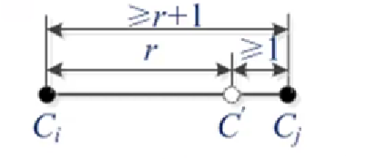
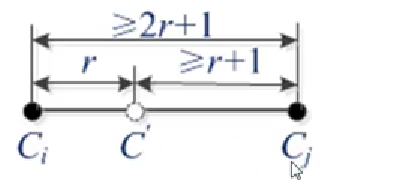
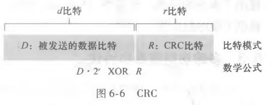
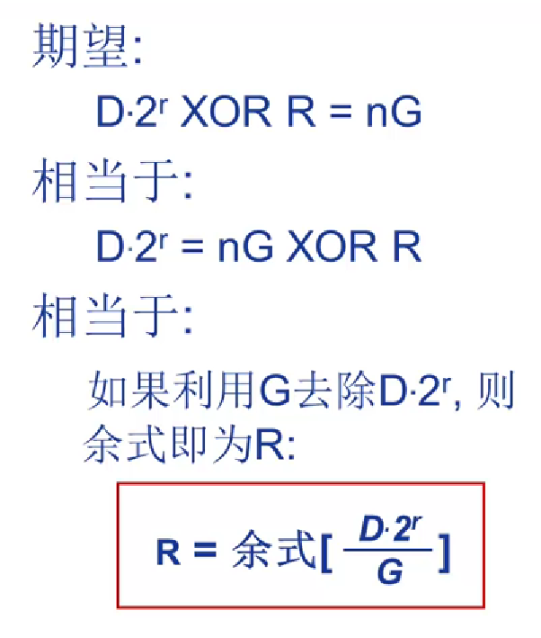
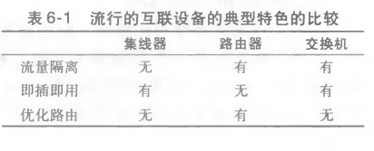
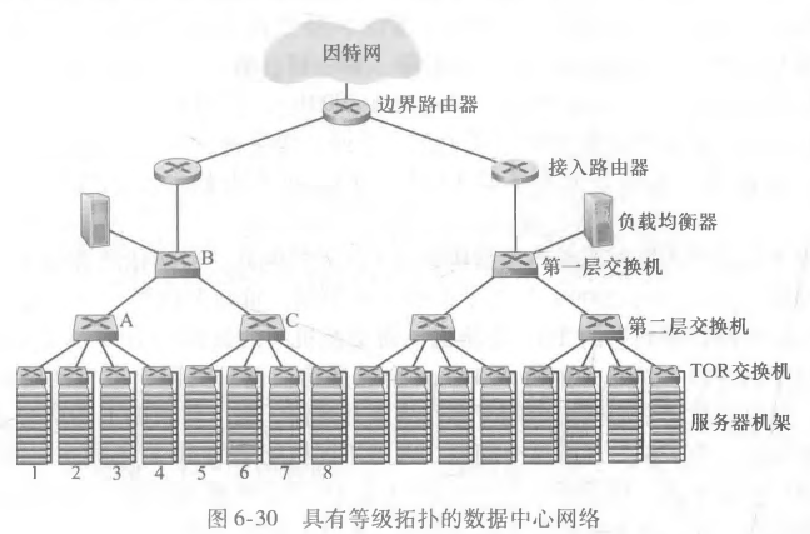

# 6.1 链路层概述

## 6.1.1 链路层提供的服务

* 成帧：将网络层数据报封装成链路层帧，储存在链路层帧数据字段中

* 链路接入：MAC协议

* 可靠交付：通过**确认**和**重传**实现

* 流量控制：协调发送节点和接收结点

* 差错检测和纠正：硬件实现，能确定差错位置

* 全双工或半双工通信

  >全双工：链路两端**同时**双向传输
  >
  >半双工：链路两端结点**交替**双向传输

## 6.1.2 链路层在何处实现

链路层主体部分在**网络适配器**中实现，许多功能都是通过硬件实现的

# 6.2 差错检测和纠正技术

* 检错码的编码集汉明距离是 r+1 则可以检测 r 位错误

  

* 纠错码的编码集汉明距离是 2r + 1 则可以纠正 r 位的差错

  将错误码字纠正成举例它最近的正确码字。基于概率最大化，未必百分百正确。

  

## 6.2.1 奇偶校验

普通奇偶校验进化版：二维化，把所有比特划分成 i 行 j 列，每行每列计算奇偶值，用这种**二维奇偶校验**还能确定位置。

接收方检测和纠正差错的能力为**向前纠错（FEC）**

## 6.2.2 Internet检验和

因特网校验和，将d比特数据作为一个k比特整数处理，将这k比特整数加起来，和的反码放在报文段首部作为因特网检验和，接收方将接收到的数据和检验和相加取反，检测结果是否全为1，若有任何比特为0，则指示出现差错。

## 6.2.3 循环冗余检测（CRC）

考虑d比特数据D，发送结点要将它发送给接收结点。
发送方和接收方首先必须商议一个r+1比特模式，称为生成多项式（generator），将其表示为G，要求G的最高有效位为1（最左边）。

对于一个给定的数据段D，发送方要选择r个附加比特R，并将它们附加到D上使得得到的d+r比特模式（被解释成一个二进制数）用模2算术恰好能被G整除。在接收方这边，用G除以接收到的d+r比特，如果余数不为0，接收方便知道了差错，若余数为0，则接收数据。

# 6.3 多路访问链路和协议

* 点对点链路：链路单个发送方和单个接收方组成
* 广播链路：多个发送和接收节点都连接到相同的，单一的，共享的广播信道上，eg：以太网，无线局域网

* 多路访问问题：如何协调多个发送和接收节点对一个共享广播信道的访问

## 6.3.1 信道划分协议

假设有一个支持N个节点的信道，信道传输速率为 R bps

TDM时分多路复用：将时间划分为**时间帧**，每个时间帧划分为 N 个**时隙**，每个时隙对应一个特定的“发送方-接收方”对。

FDM频分多路复用：将信道划分为**不同频段**，每个频段有 R/N 带宽，每个频率分给N个节点中的一个。

CDMA码分多址：对每个节点分配不同**编码**，每个节点通过唯一的编码对所发送的数据进行编码。**能实现不同节点同时传输（抗干扰）**。

## 6.3.2 随机接入协议

每个节点碰撞后等待一个**独立的随机时延**，由此避开碰撞。

1. 时隙ALOHA协议

   假定结点只能在时隙开始时刻发送帧

   节点产生碰撞则在后续每个时隙中以**概率p**重传它的帧，直至该帧无碰撞传输出去

   特点：

   允许节点以**全速 R 连续传输**，但多个活跃节点存在时效率下降，部分时隙被碰撞浪费，N个活跃节点时一个时隙效率：
   $$
   Np(1-p)^{N-1}
   $$
   最大效率为**1/e=0.37**

2. ALOHA协议

   与上一个方法相比没有时隙划分，增加了冲突可能性，协议更简单

   每个节点一收到帧就送，碰撞了立即以概率p重传该帧。完全分散ALOHA最大效率：1/(2e)

3. 载波侦听多路访问（CSMA）

   * 说话之前先听（载波侦听）
   * 如果与他人同时开始说话，停止说话

   >为何载波侦听了还会发生碰撞？
   >
   >广播信道存在端到端传播时延，时延越长，载波侦听节点无法侦听到网络中另一个节点开始传输的机会越大

4. 具有碰撞检测的载波侦听多路访问（CSMA/CD）

   碰撞后利用**二进制指数后退算法**随机选择等待时间，可选择区间随碰撞次数增加而增大

   效率：
   $$
   d_{prop}:信号能量在任意两个适配器间传播所需最大时间\\
   d_{trans}:传输一个最大长度的以太网帧的时间
   $$

## 6.3.3 轮流协议

1. 轮询协议

   设定一个主节点，轮流告诉别的节点它们所能传输的帧的最大数量

   特点：消除碰撞和空时隙；但是影响只有一个活跃节点时的传输速率；主节点有故障，整个信道都不可操作

2. 令牌传递协议

   令牌（小的特殊帧）依次传递，收到令牌，有帧需要传输则传送最大数目帧数然后转发令牌，没有帧要发立即把令牌给下一个。

   特点：一个节点故障就能导致整个信道崩溃

# 6.4 交换局域网

## 6.4.1 链路层寻址和ARP

1. MAC地址（没有两块适配器有相同地址）

   并不是主机或者路由器有链路层地址，是它们的适配器（即网络接口）有链路层地址。所以有多个接口的主机或路由器就有多个链路层地址。

   **链路层交换机不具有链路层地址**，它透明执行任务，主机和交换器不必明确将帧寻址到其间的交换机。

   >IP地址具有层次结构，而MAC地址则是扁平结构，适配器到哪里用都不会变化，IP地址会随主机位置改变而改变

   发送适配器要所有其他适配器处理和接收它发送的帧，用广播地址：FF-FF-FF-FF-FF-FF(48个1)

   **除了网络层地址还要MAC地址的原因：**

   1. 方便支持其他网络层协议
   2. 不用MAC地址，网络层地址必须储存在适配器RAM中，还得随位置改变，或者适配器不用任何地址，收到帧就往上传，网络层核对，这样局域网发送的每个帧都能中断主机。

2. 地址层解析协议

   地址解析协议（ARP）：将**网络层地址和链路层地址**进行**转换**的协议（IP地址--->MAC地址）

   > ARP和DNS区别：DNS为在因特网中任何地方主机解析主机名为IP地址，ARP只为在同一个子网上的主机和路由器接口解析IP地址。

   当ARP表中没有目的主机的表项时：利用广播地址FF-FF-FF-FF-FF-FF发送ARP查询分组，每个适配器都会将该ARP分组向上传递给ARP模块，检查自身IP是否与分组中的目的IP地址匹配，匹配则返回带有它MAC地址的**响应ARP分组**，查询主机更新ARP表，并发送IP数据报。

   * **ARP视为跨越链路层（ARP分组包含链路层地址的字段）和网络层（包含网络层地址）边界两边的协议**

3. 发送数据报到子网以外

   先发送到子网中，利用ARP送往第一跳路由器上，通过路由器的转发到子网二的接口，该接口把数据报传给它的适配器，适配器将其封装成帧然后发送到子网二中，此时该帧的目的MAC地址就是最终目的地MAC地址。

## 6.4.2 以太网

* 初始以太网：使用**同轴电缆**的**总线拓扑**结构，所有传输的帧传送到与该总线相连的**所有适配器**并被处理

* 20世纪90年代：基于**集线器**的**星型拓扑**以太网

  集线器是一种物理层设备，无论何时集线器从它的一个接口接收到一个比特，它向它所有的其他接口发送该比特的副本。若是两个接口同时收到帧，会发送碰撞，产生帧的节点必须重新发送该帧。

* 21世纪初，集线器被**交换机**替代，线段变为**双绞铜线活光纤线缆**，交换机仅运行在第二层

  1. 以太网帧结构

     * 数据字段：承载IP数据报（也可以是别的网络数据报）。
     * 目的地址：目的适配器的**MAC地址**
     * 源地址：传输该帧到局域网上的适配器的**MAC地址**
     * 类型字段：允许以太网复用多种网络层协议
     * CRC：循环冗余检测，使得接收适配器检测帧中是否引入差错
     * 前同步码：使目的主机适配器的时钟和发送方的同步，同时提醒接收方有数据帧到来。

     以太网**没有握手步骤**，A给B发数据报，适配器A直接在一个以太网帧中封装该数据报，并将帧送到局域网上，没有和适配器B先握手

     以太网技术向网络层提供**不可靠服务**，CRC不返回校验结果，只是丢弃未通过校验的帧，发送方根本不知道是否通过校验

     今天使用的以太网是基于交换机的星型拓扑，采用的是储存转发分组交换，不需要MAC协议了。交换机协调运输，统一时间绝不会向相同接口转发超过一个帧，现代交换机还是**全双工**的，一台交换机和一个节点能够同时向对方发送帧而没有干扰。

## 6.4.3 链路层交换机

交换机自身对子网中的主机和路由器是**透明**的，主机/路由器向另一个主机/路由器寻址一个帧，不知哪个交换机会接收该帧并将它转发。

1. 交换机转发和过滤

   过滤：帧应该**转发还是丢弃**

   转发：帧应该被**导向哪个接口**，并把帧移动到那些接口

   过滤和转发操作借助交换机表完成，交换机表项包括：MAC地址，通向该MAC地址的接口，表项放置在表中的时间

   eg：目的地址DD-DD-DD-DD-DD-DD 从接口 x 送来

   * 没有目的地址的表项，**广播该帧**
   * 有表项，但是接口是 x，**丢弃该帧**执行过滤功能（此时意味着该帧在包含目的地的局域网网段广播过了）
   * 有表项，接口是y，y！=x，执行转发，将该帧放到接口y前面的输出缓存
   
2. 自学习

   1. 交换机表初始为空
   2. 每个接口接收到的每个入帧，该交换机在其表中储存其**源MAC地址和到达交换机的接口，时间**
   3. 一段时间后没有收到以该地址作为源地址的帧，在表中删除该地址

> 交换机是**即插即用设备**，不需要网络管理员和用户的干预。交换机也是双工的，每个接口都能同时收发。

3. 链路层交换机的性质

   * 消除碰撞
   * 异质的链路。交换机将链路彼此隔离，局域网中不同链路能以不同速率在不同媒体运行。
   * 管理。能检测适配器异常并断开。

4. 交换机和路由器比较

   交换机优点：

   * 即插即用

   * 相对高的分组过滤和转发速率

     缺点：

   * 为防止广播帧循环，交换网络的活跃拓扑限制为一棵生成树

   * 大型网络要主机和路由器有很多ARP表，产生可观的ARP流量和处理量

   * 对广播风暴不提供保护

   路由器优点：

   * 网络寻址分层次，即使网络中存在冗余路径，分组也不会通过路由器循环，所以分组不会被限制在一棵生成树上，能使用源和目的之间的最佳路径
   * 对第二层广播风暴提供防火墙保护

   缺点：

   * 不能即插即用
   * 分组处理时间比交换机长，因为它必须处理高达第三层的字段

   

   一般情况，小网络交换机，大网络在交换机之外还要路由器

## 6.4.4 虚拟局域网（VLAN）

支持VLAN交换机允许经一个单一物理局域网基础设施定义多个虚拟局域网，在一个VLAN内主机彼此通信。

互联两个VLAN：

1. 将VLAN交换机一个端口与外部路由器相连，配置该端口属于两个VLAN。

两台同VLAN交换机如何互联：

法一：每台交换机上定义一个属于该VLAN端口，将俩端口互联，不具备扩展性

法二：**VLAN干线连接**

# 6.5 链路虚拟化：网络作为链路层

## 多协议标签交换MPLS

MPLS基于标签执行交换，而不必考虑分组的IP地址

MPLS优点：

1. 交换速度潜在增加
2. MPLS使能的新的**流量管理能力**，使用MPLS的一种**流量工程**：网络运行者能超越普通IP路由选择，迫使某些流量沿着一条路径朝着某给定的目的地引导，并且朝着相同目的地的其他流量沿着另一条路径流动。
3. MOLS转发路径的快速恢复
4. 实现**虚拟专用网（VPN）**

# 6.6 数据中心网络

1. 负载均衡

   外部请求首先被定向到负载均衡器，负载均衡器根据主机当前负载进行负载均衡，将该请求分发到处理该应用的某台主机上，处理完请求，向负载均衡器回送响应，再由负载均衡器将其中继发回给外部客户。

   负载均衡器不仅提供平衡主机负载工作，还提供类似**NAT**功能，将外部IP转换为内部适当主机IP，然后将反方向流向客户的分组按相反转换处理。防止客户直接接触主机。

2. 等级体系结构

   

3. 数据中心网络发展趋势
   1. **全连接拓扑**替代交换机和路由器的等级结构
   2. 采用基于船运集装箱的**模块化数据中心（MDC）**

# 6.7 Web页面请求的历程

## 6.7.1 准备：DHCP，UDP，IP和以太网

运行DHCP协议，获取IP地址，DNS服务器IP地址，默认网关路由器IP地址，子网块（网络掩码）

## 6.7.2 仍在准备： DNS和ARP

利用ARP获取网关路由器MAC地址，发送DNS查询的以太网帧到网关路由器。

## 6.7.3 域内路由选择到DNS服务器

DNS查询报文送到DNS服务器，获得DNS回答报文，得到www.google.com的IP地址。

## 6.7.4 Web 客户-服务器交互：TCP和HTTP

便携机发送HTTP报文，执行三次握手，进入连接状态，利用HTTP报文获取网页，成功显示！
