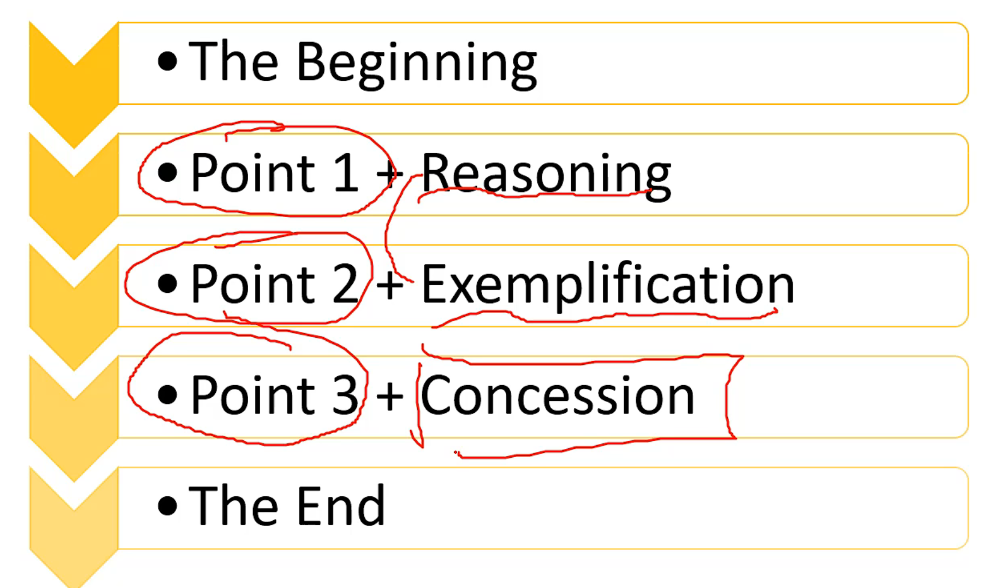

## Task one

1. Introduction paraphrase the question 重写题目
2. overview 2 sentences 2 main points
3. detail
4. detail

# Task Two

:star:词汇

* adversely influence 负面影响
* all-round development 全面发展
* transportation network 
* educational resources

* healthcare facilities
* financially independent
* habitual offenders 惯犯
* potential criminals 潜在罪犯
* broaden horizons 开拓视野
* better-konwn 更加闻名
* disposable products 一次性产品
* fame and profit 名和利
* values 价值观
* suburban area 郊区
* make joint efforts 共同努力
* 而不是：rather than / instead of
* relationships = social bonds
* demolish 拆除
* post a threat to / threaten
* the continuous/excessive/extensive use of 持续/过度/广泛使用
* sustainable economic prosperity 持续的经济繁荣
* asset 资产
* human resources 人力资源（复数，记得用assets）
* environmental pollutions 环境污染
* be confronted with / face serious social problems 面临严峻的社会问题
* unemployment 失业
* **disturbance and damage** 干扰和损害
* daily communication 日常交流
* energy-using vehicles 燃油车
* **social skills / inerpersonal communication 人际交往**
* mortgage 贷款
* Laying the foundation for future career development 为将来职业发展打基础
* Enhance competitiveness 增强竞争力