# Part1 

* 每个问题**3-5句话**

* 三类题，每类问三道

* 第一类永远是**必考题**：家乡、学习工作、住宿（周边环境）

  **住宿**

  Where are you living at the moment?

  > "I currently live in a dormitory on campus, which is a **four-person room with bunk beds and desks.** The room is equipped with air conditioning and a private bathroom, but the downside is that the floor is made of concrete without tiles. This makes the dormitory look outdated."

   What do you like about the area you're living in?

  >"I live in the center of the university campus, which makes it convenient for me to attend classes either on the east or west side. Additionally, there are shops and cafeterias near the dormitory, so it's very convenient for me to buy things or grab a meal."

   Do you know many other people who live nearby?

  >"I do not know many people living near my dormitory, as I had switched dormitories once due to having different schedules with my roommate. Currently, I reside on a different floor with students from another class, and there is no culture of visiting each other's dormitories, so I have little opportunity to get to know them."

  **学习**

   What do you study?

  >I am now studying for a degree in computer science. In short, this means that I learn a variety of  different coding languages, from C++ to Python. On top of this, we also learn how to implement these codes  towards profitable projects and how to utilize our skills in the business world. 

   Do you sometimes feel that you have to study too hard?

  >yes, I often feel like I have to work hard to study because I major in computer science and computer science is such a popular major that even students from other majors want to switch to it. As someone who is majoring in this field, I have to work even harder to ensure that I can find a job and not be replaced by students from other majors who might steal my job opportunities.

   What do you like to do just after you finish class every day?

  >After I finish class each day I like to meet up with my classmates and spend some time doing  activities in the city. While at class I find studying very isolating, so I like to do social things once I  am done with my classes. Most days we will either go out to a restaurant together or get a coffee in a  local café. Sometimes we do more exciting activities such as playing basketball or table tennis.

  **家乡**

  

  可用顺延法（先讲观点，然后讲原因），没话说了就加个结尾

* 万能理由：**心情、金钱、健康、效率/时间** 

  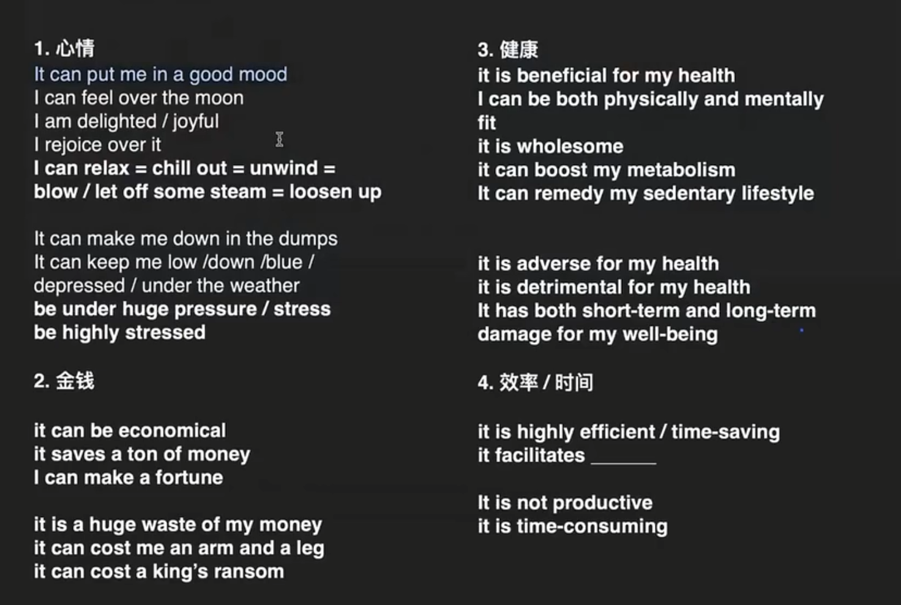

* 套用万能理由，加上连接词，拿下part one

# Part 2

* 说满两分钟

* 四种cur cards:**人物、地点、事件、物品**

* 人物、地点 物品 都可以用事件题的思路，**事件是核心**

  套娃合并法

  * 所有part two 分为具体类和抽象类
  * 具体类题目就得好好准备
  * 抽象类可以通用，套套具体类的示例
  * 抽象类套具体类，**大套小**

  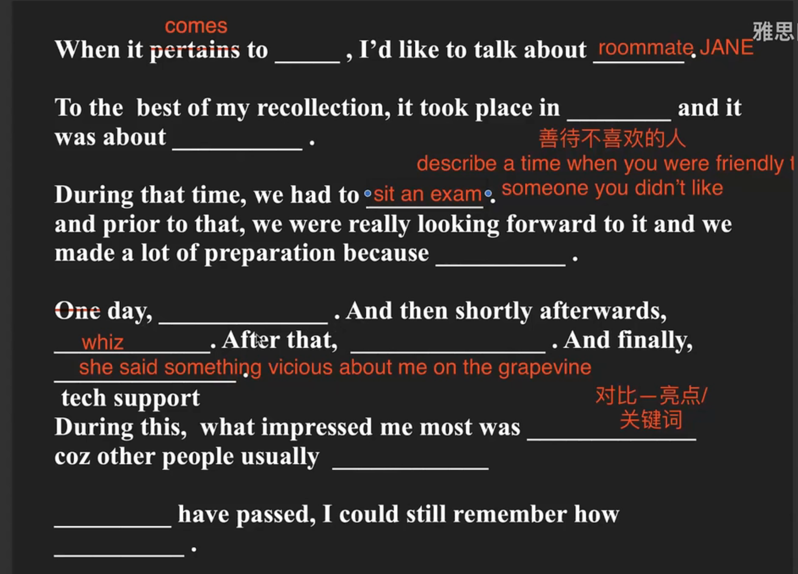

# Part 3

* **6-8句话**

* 找下义词

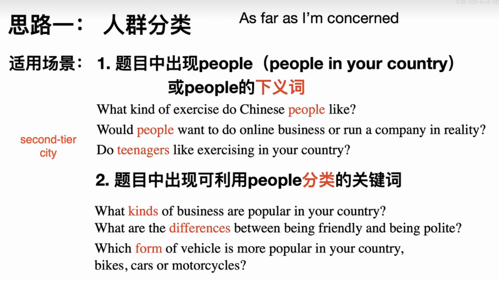

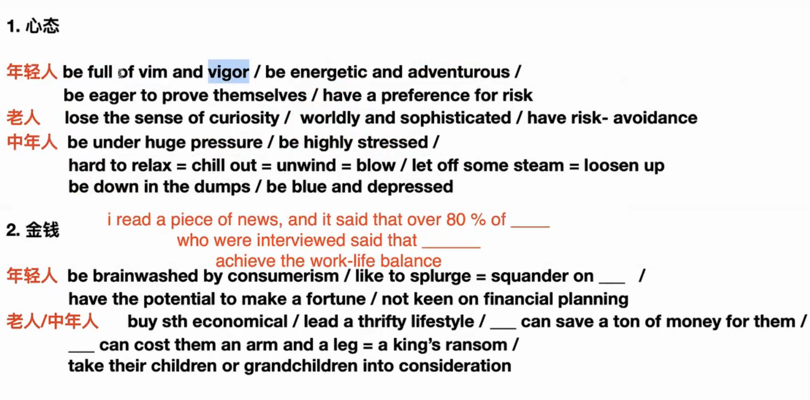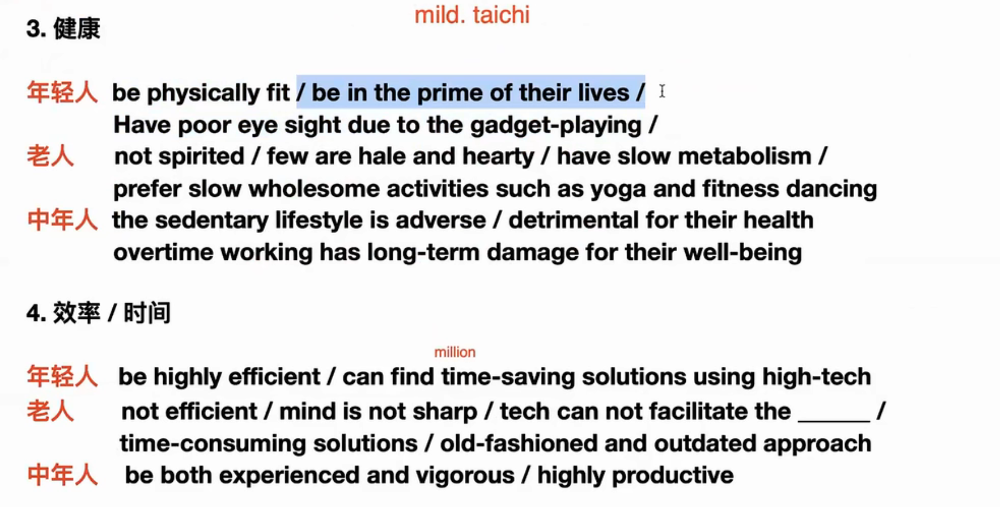

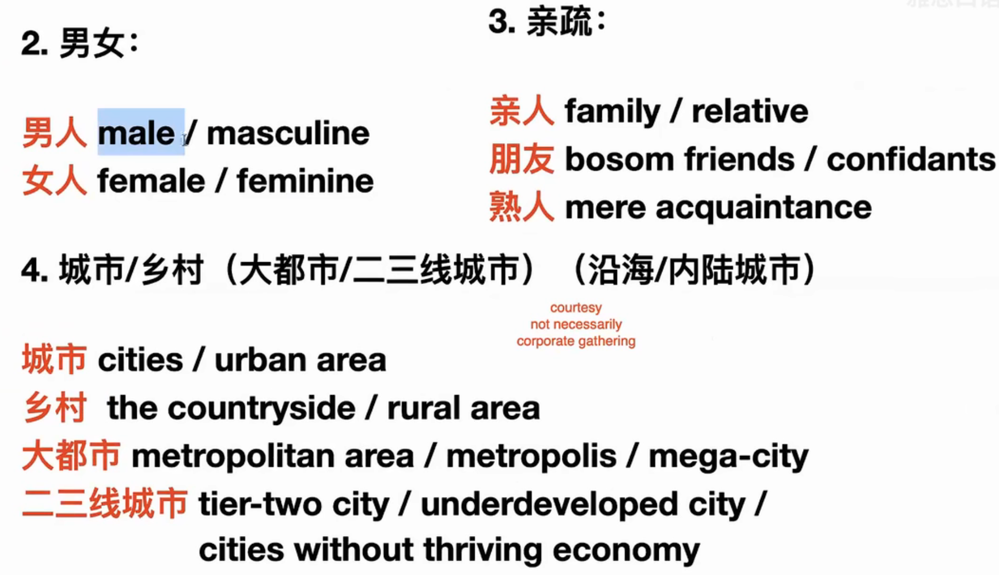

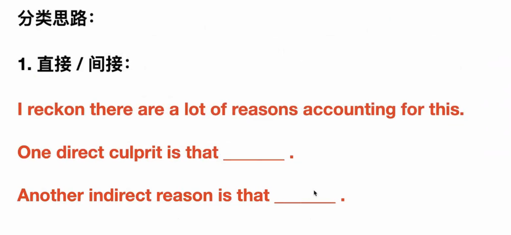

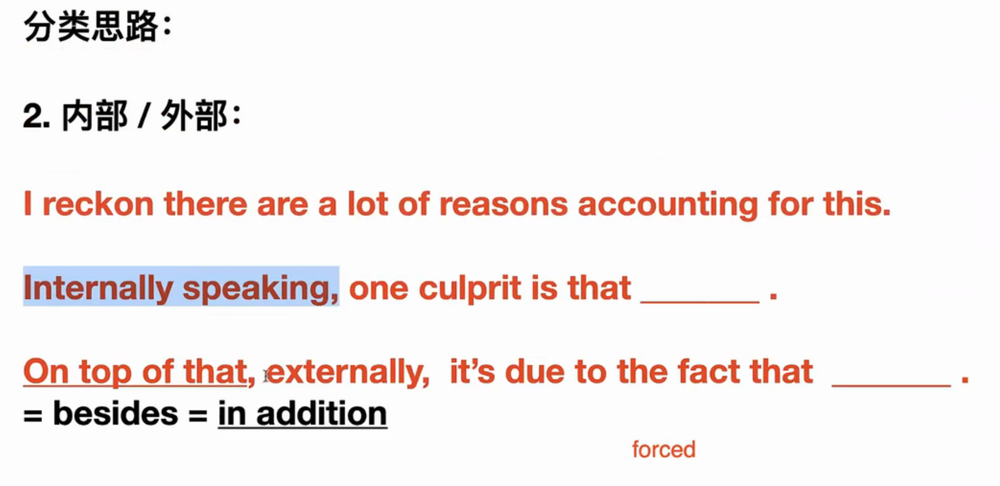

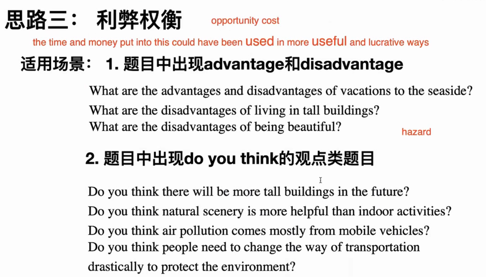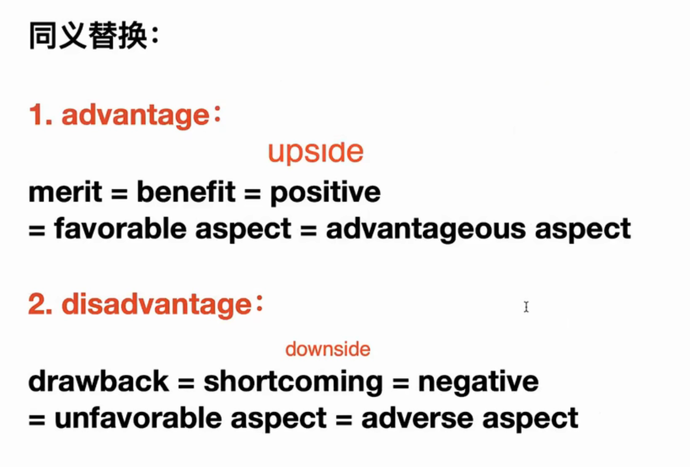

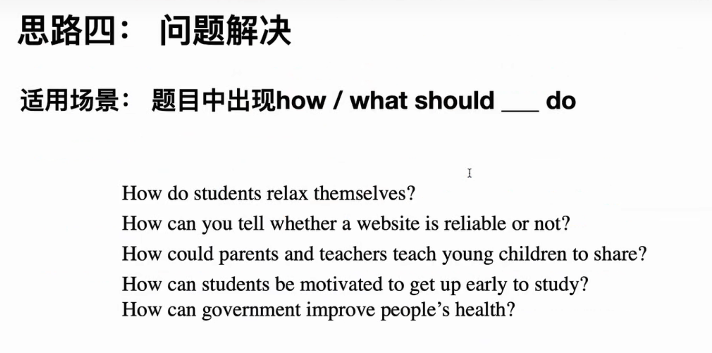

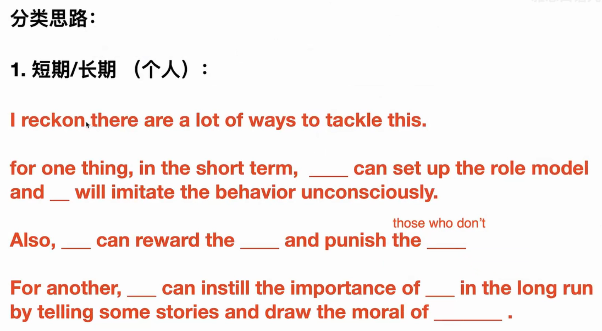

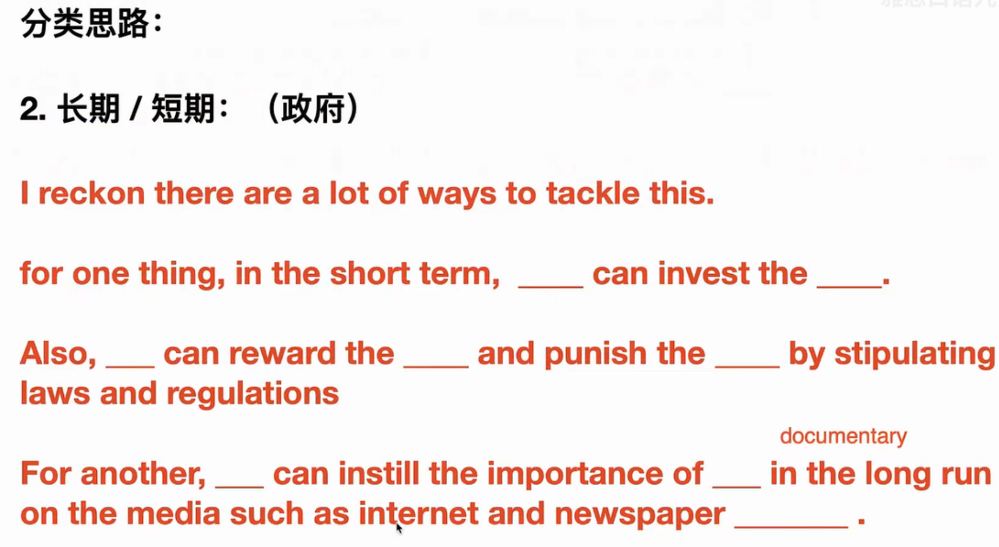

# 一些要记的词

* for starters（firstly）
* In a nutshell 简单来说
* so it's no exaggeration to say 不夸张地说
* wholesome 有益健康的
* I can feel over the moon 很开心
* hearty smile 灿烂的微笑、
* 墨守成规：think in the box / conform with the norm
* involution 内卷 under the pressure of involution 
* get caught in sudden rainstorms 
* **procrastination problem 拖延症**
* **mental suggestion 心理暗示**
* **noise-canceling earphones 降噪耳机**
* **boarding student 寄宿生**
* richness and vibrancy of the city 城市的丰富和活力
* chaotic 吵闹的
* screaming and whining 尖叫和抱怨
* at least by far 至少现在是这样的
* **locksmith 锁匠**
* **monitor 显示器**
*  renovated 重新装修
* **mental work 脑力劳动**
*  **state-owned enterprise 国企**
* private enterprise 私企
* **Line up to enter the scenic spot 排队进入景区**
* Traveling during off-peak hours. 错峰出行
* college entrance examination
* **goggles 护目镜**
* **Postgraduate entrance examination 考研**

## 1：Hometown（新题）

* What’s (the name of) your hometown?

  **It's a scenic and peaceful little town located in the costal area in the southeast part of China**. It is a coastal city with beautiful scenery and rich cultural heritage. I was born and raised there, and received my education in that city until I come to Wuhan to attend university.

* Is that a big city or a small place?

  

* How long have you lived there?

# 串题

## 迷路 & 得到错误信息的时刻 & 投诉并得到满意结果

找小吃店迷路，因为地图给出的错误信息找到了一家已经关门的店铺，最后在店员的帮助下找到了店铺的位置，店员非常热心和耐心，非常感谢店员，但是地图不准确让我十分生气，我事后投诉客服（costumer service）最后得到反馈，因为这些店铺经常更新（open and close），所以他们可能会出现不及时更改的情况，没法保证完全正确（completely accurate），他们很快修改了地图的显示，并保证尽可能(make every effort)让地图是最新的(up-to-date)符合实际情况的(accurate)。知道问题背后的原因，并看到他们的迅速反馈（Prompt response.）和良好态度后，我表示理解并消气了（ I expressed my understanding and no longer felt angry）。

## 

## 家里舒服的某处地方 & 一个享受的生活习惯 & 理想房子/公寓 

家里最舒服的地方是我的balcony，那儿有个椅子可以躺着，我经常在学习很久感到疲惫后坐在那，或者在心情不好感到烦躁的时候去那儿休息一下放空自己。我躺在那儿的时候什么都不会想，只会看着窗外的山和河流，这能让我的内心平静下来。这个地方还能看到日出如果你起的够早的话，能看到太阳从山上出现，这些美好的景色着实会让人感到心情舒畅。btw，当我在家感到无聊，不知道做什么的时候我现在也会选择去窗台看风景，时间不知不觉就流逝了。

## 童年趣事 & 童年游戏 & 年轻时的空闲活动

* riding bike with my neighbor friends
* we create so  many kinds of games based on the bike like how fast or slow you could ride
* and whether you could ride your bike through certain obstacles like very narrow passageways or trying to go through all the poles **in one go**
* It take place in my old house ,and it is about ten years ago when I was **in second or third grade of elementary school**
* I got a second-hand bike that my cousin used before. I spent the whole afternoon learning how to ride it on the day I got the bike. After I learned, I would go downstairs every afternoon to ride and play with my neighbor friends.
* I had always want **a bike of my own.**
* I enjoying riding a bike because I can play with my friends who have bikes too, and there are so many kinds of games we can play together. Besides, I want to ride a bike to school not for the purpose of saving time but for the reason that it seems cool to my classmates.

## 和小孩相处的时刻 & 教朋友或亲戚的时刻

* the last time I spent time with a young child may be the last summer vacation if my memory severs me right, and it took place  in my home.

* Before I went home from the college, I had known that my younger cousin was going to live in my home for several days. Because his mom wanted me to teach him how to study efficiently, as I am one of the best students in my family in terms of academic performance. After knowing this, I was really looking forward to it coz I had not saw my cousin for several months. I would like to play with the cute guy and was glad to teach him how to study. Before he came to my house, I had already recalled many study methods that I used during my high school years and planned to teach him

* Then when he came to my home, we really have a good time together. We studied together on the day and play games on the night. When we studied together, I would observe whether he is focused on learning and provide him with some efficient solutions when he asked me questions. Besides studying, I will also teach him what is good study habit he should follow and share some information about college majors which he is interested in.

* 教亲戚或朋友的时刻：how easy it was to teach him

  As one of the best students in my family, I think all his questions is so easy that won't even cost me more than five minutes to solve. Although I may forget some related knowledge about it, I can recall them after a quick through of the textbook.

* Every time I saw his progress after teaching him, I felt **a genuine sense of pride**. And I was really happy when playing with him.

## 未来想去的遥远地方 

我想去欧洲的那几个有着地中海气候（Mediterranean climate）的国家，例如意大利。我也想去荷兰，德国，法国等国家，有的是因为那里的宜人气候，有的是因为那里的美好自然风光，有的是因为那里的悠闲生活。我想要和我的初中同学一起去，尽管我认识了很多大学同学和高中同学，我和我初中同学还是最好的朋友，我们每个假期都会聚在一起出去旅游来维持和增进我们的友谊（maintain and enhance our friendship）。

## 

## 受欢迎的人 & 乐于助人的人 & 想要一起工作/ 学习的人

* The most popular person I've ever met is probably my high school classmate Seth. He was the math class representative. I don't know if this concept exists in other countries. The class representative is responsible for collecting and distributing homework, sometimes helping the teacher mark the papers, and assisting classmates with subject-related issues. That sounds like teaching assistant in college.

* As a representative, he is very responsible. To better help us with math problems, he works hard to study math. And whenever you ask him questions, he will spare not effort to help you. He is a very patient guy, so you don't need to worry about being scolded by him for asking stupid questions. This greatly improve the atmosphere of learning mathematics in our class. Several students get higher score in math exam thanks for his help.

* He is not only helpful, but also keen to participate in class activities. I can still remember once there was a football math between classes, and our class didn't have enough people to participate. Despite not knowing how to paly football, he still joined the game. Many students took him as an example and actively participated in the competition.

* He is not only popular for his good personality, but also for his handsome appearance. So there are many girls would like to make friends with him. Who can say no to such a handsome guy with good personality?

* 乐于助人的人：explain why you think this person often help other people

  Partly because his parents have always taught him to do so, partly because he was born that way. 

* 想要一起工作/ 学习的人：

  we studied together for three years in high school.

  he really know how to comfort people when they are down. I once felt very depressed after failing a exam, he just come and carefully help me analyze the reason I failed the exam and give me many useful tips to solve the problems. After his analysis, I regained my confidence and do well in the next exam.

  How can you don't want to study with such a good guy?

  

## 有用的发明 & 难用的科技产品 & 常用网站

chatgpt

## 新开的商店 & 存钱买贵重礼物 & 喜欢穿的衣服 & 收到急需品的时刻

* animal cream 动物奶油

## 让你失望的电影

* godspeed
* But the plot of the movie does have a lot of irrationality
* The only value of this movie is the few moments that make you laugh
* This movie wasn't as good as advertised, didn't meet my expectations, I think it's over rated on the Internet.
* some things led to misunderstandings between the main character and his future father-in-law
* There's nothing about this movie that's different from other movies, there's nothing about it that impresses you
* This movie does not contain any practical significance worthy of people's thinking
* After watching the movie, I think it's just a normal comedy
* Horror film 恐怖片
* Romance 爱情片
* Sci-fi movies 

## 演讲经历 & 跟别人一起做事的经历 

* junior 学弟学妹
* promote my university to them
* We don't have enough promotion for our school, so its popularity isn't high

## 多次阅读的书 & 想了解更多的历史

* Understanding history is an important means by which we understand our own culture and roots, learning history can enhance national pride and cohesion, and lessons can be learned from history
* fantasy novel 玄幻小说
* historical/cultural relic 文物
* each one has its own mind and soul and they will take you back to the time when they was constructed and the story about them. 
* feel the history more realistically
* help them make up for the regret

## 印象深刻的汽车旅行 &  有趣工作 & 人山人海之地 & 想短暂停留的城市

* 汽车旅行：

  the car journey took place in Diqing, Yunnan Province last summer vacation.

* I went there with my friends in middle school. It may sounds a bit surprising. Because xxxxxxx

* We joined a small tour group which we made up the majority of the group. The tour guide drove us to visit different attractions around the city. We all felt fortunate that we made the decision to join the tour group coz there were almost no public transportation, we didn't even see a taxi in the city. I can't image how can we travel so many attractions without a car.

* The journey took three days and the last day is most interesting. The tour guide took us to his home that day. We visit his home and had a meal there. I should say it is the best meal in my three days journey. After lunch, his family told us about some local customs and traditions here. They also showed us some local specialties(特产). I have never been to a local's home   through a tour group. So it's very impressive for me.

* 有趣工作：

  I think being a tour guide can be quite interesting, coz you can meet different kinds of people everyday and you may make friends with a lot of them. I like making friends. Besides, you can travel to tourisms every day, may be you will get tired of some tourisms, but for those with  beautiful sceneries, you will never get bored not matter how many times you see them. 

* The skills needed for the job may be a good communication skills. You have to interact with many people every day, and learn how to communicate better with them will not only improve the customer experience which will benefit you career a lot, but also make you own work easier and more enjoyable.

*  短暂停留：

  what would you like to do there?

   In the first few days, I will go to some famous attractions and restaurants there. These two things are essential in every trip I take. Then after those days of travelling, I would like to live as locals to experience the lifestyle in this city. It's said that the lifestyle there is low-paced and relaxed compared to that in big cities. I truly want to try it myself. And if there are still some time, I may learn something about the culture and history there.

  After all these is done, I will leave the city coz the sun is very hot in that place and it's easy to get a tan and even a sunburn here without lotion(防晒霜). And the altitude there is over one thousand meters, I may not be able to adapt life in such high altitude.

* 人山人海之地：

  there is nothing different in this place but it's a tourism so there are many peoples every day, especially in vacations like summer vacation when I went there. 

  There are several feelings in my mind when I saw so many people. One is that **the more tourists there are, the more worth visiting the place is**, this idea made me more excited about the travelling.  But there are also many bad effects. For example , too many people there greatly 

## 住所附近的变化

* a new playground, a new indoor swimming pool
* **Goggles and masks. 护目镜和口罩**
* prune the leaves of the **French plane tree** which can help shade the sunlight
* but the **fluff** of the tree is really annoying, they float in the air and easily float into your eyes or nose. 
* I'd rather be exposed to the sun than to the French plane tree fluffs.
* They will make a new plan next year based on the situation after pruning the trees this year

## 重要决定 

* choose the major in college
* **Dentistry 口腔医学**
* medical science 医学
* anatomy 解剖学

## 完成骄傲的事 & 想尝试的冒险 & 以后想学习的事情

* I managed to snowboard down a moderate slope without falling 

* I did it by learning how to snowboard the whole day with just a short break to eat lunch

* Because I had never learn snowboarding or skating before. So I didn't know how to keep balance at first and just fell again and again. 

* I felt a great sense of achievement because it wasn't an easy task for me. I fell numerous times during practice, and there were times when I wanted to give up. However, I persisted and successfully snowboarded down the slope in the end. I am proud of my perseverance.

* 冒险：

  If there is an adventure I would like to take in the future. I think it may be snowboarding from the top of the ski slope without falling.

  To achieve this, I need to go to somewhere with ski area first. I think Changbai Mountain in Jilin Province is a good choice coz the ski area there is well-known through out the country. I believe the good ski area will be helpful for my learning.

## 传统节日 &  不寻常的一顿饭

* lunar New Year 农历新年
* New Year's Eve dinner 年夜饭
* Japanese pirates 倭寇
* After four days later, the enemy was beaten away
* On the day of the New Year's Eve dinner that year, the Japanese pirates invaded our city. Four days later, the enemy was driven away, and we all decided to **make up for the missed New Year's Eve dinner that night. **And that became a tradition that has been passed down to this day.
* the best meal I can have throughout the year
* Air fryer 空气炸锅

## 爱看的体育运动

* NBA 
* watch it with my classmates in high school or college
* first watched it in high school
* I watched it first for the reason to join the group of people who play basketball in my class, and I just began to learn basketball at that time. 
* Become familiar with them by watching the NBA and increase the topics I can discuss with them, and join this group and play basketball with them
* To join this group, I also made other efforts like learning the knowledge about basketball shoes.
* And I can still remembered that my first basketball shoes is PG3. A basketball shoe designed and produced by Nike for NBA player Paul George.
* I will watch most of Curry's playoffs

## 想尝试的水上运动

* The water sport I most want to try is surfing
* cool 
* hard to keep balance 
* don't know when the next wave would come
* it is harder when you surf in a higher speed
* Give me a feeling of conquering the sea
* Don't worry about being shot into the sea by the waves
* I have seen so many reality shows where those celebrities learn how to surf, and I think it is quite interesting
* I would like to learn it with my friends, coz we can see each other being beaten by the waves and falling into the sea, then we may laugh at each other. it will be fun.

## 开学的第一天 

* enter the campus in the afternoon
* walk around the campus with my elder brother who came with me to have a trip in the city and help me carry package and clean up the dormitory
* it is really big, and there are so many trees that I can not even see where the sun is in the afternoon.
* The temperature is lower, feel cool
* My brother left after dinner in a canteen which is randomly chose coz I am not familiar with the school yet
* We gathered in the dormitory of the monitor to play board games and get to know each other
* The second day is military training, so we went back to our dormitory very early
* But I was excited about the first in college, so were my roommates, so we play mobile games till late at night before going to bed.

## 迟到

* late for a train 
* it was last summer vacation, in the train station
* I was going back to home after finishing my final exam
* I bought a train ticket online for the next day morning.
* I discussed with my father what time should I get up the next day, and we both thought it would only take less than an hour to get the train station. 
* But when I got on the subway the next day, I found that one hour was not enough to get to the train station.
* When I got the station and on a elevator to the **ticket gate,** I saw the train I was going to take set off and left the train station.
* It the first time I had missed a train, I had no experience. **My mind went blank at that time.**
* call my father for help, and bought another ticket on the station.
* The feeling of missing something important is terrible, and I never want to experience it again. 
* From then on, I will set aside a lot of extra time to go to the train station, I would rather wait there for a while than miss the train again

## 去过的一个空气不好的地方 & 嘈杂的地方

* the new development is that there are so many buildings being constructed.  Before that, this is a village here. 
* The construction of buildings around my home has caused many problems which severely impact my life. **The worst one** is the issue of noise. They generate countless noises everyday.
* The construction of these buildings is still ongoing, and I don't know how long it will need to complete, may be one more year or less.
* Before the construction, it was a small village on the border of the urban area and countryside. Due to the government's plan, this village was demolished and abandoned long time ago. However, it wasn't until two years ago that they started to build new buildings here.
* As the construction began, the air was no longer clean any more, if you open the window, you would find that the air is mixed with lots of dust which you can easily see on the surface of every furniture.
* The other problem is the noise problem, although they are forced to stop when it's late at night. You can still be affect by them during the day, especially when you want to focus on study or something else need concentration. And if you don't take a nap at specific time in the afternoon, you will also be disturbed by the noise.
* One more thing to say is that the buildings on the direction of balcony absolutely  blocks my view of the river. I was really sad after knowing this.

## 不喜欢的广告

* Chinese tiktok about two months ago 
* When I was scrolling through Douyin
* it an advertisement about a mobile game, it look quite interesting and have a link to download this game on the bottom of the advertisement
* When I played the game, I know I was cheated, it was absolutely different from what I saw in the advertisement. They are totally two different games.
* Not only the gameplay is different, but the character style is also different. And just after a few minutes, it began to charge you if you want to continue. 
* I uninstalled it right away.
* Then it occurred to me that I had seen a video talking about this type of ad
* They are produced by a company which will spend far more time on ad than the game itself.
* The only purpose of the company is to attract you and make you click the link. The more people click the ad, the more money they can get. And they don't care how people feel after downloading the game. 
* Lied to you to download a game

## 见过的有趣的老人 & 派对里交谈甚欢的人

* tour guide in a journey
* a stranger sat in the same table
* car journey
* the tourism we were going to visit the next few days
* the local culture and history.
* actively help us to get more side dish like lamb roll,
* It seems that he doesn't care so much about the profit of the agency, but care more about us.
* a party held by several travel agencies
* **he is a good talker**, although it was the first time I meet him, I did not feel speechless or embarrassed when talking with him.
* ask something about us
* He joked a lot and made our journey full of laughter

## 最近搬家的人 & 别人的好消息

* my elder cousin bought a new house with river view in the capital city of my hometown
* I was excited to hear this news coz he invited all my family to go to have a visit to his new house when he decide to move there
* I feel so envious and proud. I think he is the most successful person in my family. 
* He is a successful businessman, although he didn't even attend a high school. But I think he is more clever than most of people who attend colleges like me. coz I know how hard it is to achieve such a great deal in business. It may be more hard than attending the top universities in the country.
* **mansion house 豪宅**
* That is the most luxurious house I have ever seen， with so many smart home technologies and expensive furniture. 
* I don't think I could ever afford a house like this in my lifetime

## 喜欢的演员

* Hi, Mom
* Zhang xiaofei, one of main characters in the movie. 
* play as the mom.
* It is a comedy movie released two years ago
* Her mother is dying, and she feel depressed and regretful
* In a state of emotional breakdown, she went back to 20 years ago accidently and become a friend of her mother at that time.
* From the view of her mom's friend, she discovered many misunderstandings she had about her mother.
* When she is going to help her mother to get some benefits to marry a richer guy who is not her father, her mom refused it coz she doesn't care so much about money, she cares more about the one she really love.
* something else show what a kind and principled person her mom is. 
* find out how much her mother loves her
* I admire her for her perfect performance, although she is in her 20s, she should play as a mom who is 40s 
* Show the kind of care a mother has for her child which make me think she is really a mom who has a child but she doesn't
* excellent acting skills really amazed me.
* it is rare in today's movies
